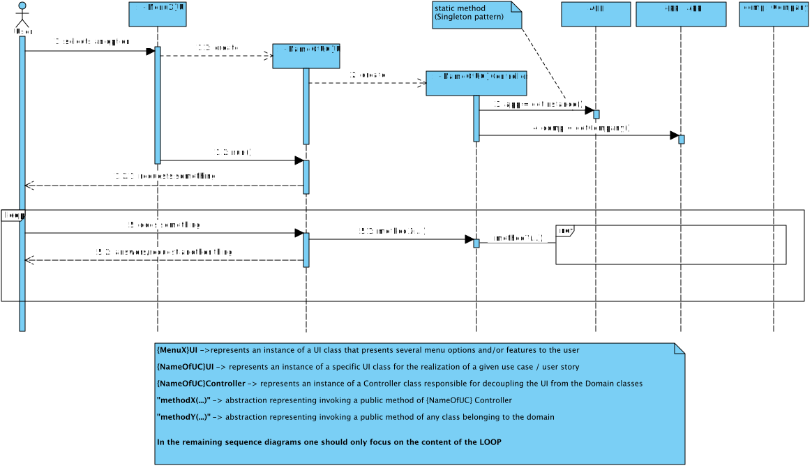
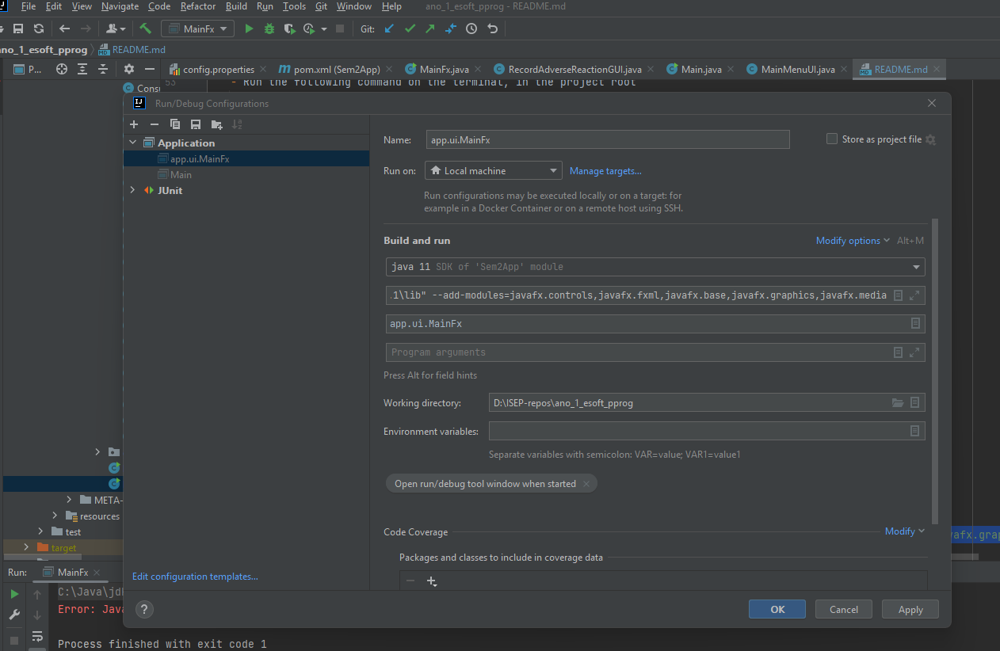

# README #

This repository contains didactic artifacts relevant to the integrative project to be developed during the second semester of the academic year of 2021-2022 in the [Degree in Informatics Engineering (LEI)](http://www.isep.ipp.pt/Course/Course/26) from [Instituto Superior de Engenharia do Porto (ISEP)](http://www.isep.ipp.pt).

In particular, it has:

* [The team members and task assignment during Sprints](docs/README.md)
* A template to capture and systematize evidence of applying properly the Software Development Process, namely regarding the activities of Engineering Requirements, OO Analysis and Design
* Source code available to students as a starting point
* General description of how the provided application works (and it is structured).

### Application Overview

The following sequence diagram graphically represents the intended flow for the application where there is a clear separation (decoupling) between the domain classes and the user interaction classes (_user interface_). This decoupling is performed by classes with the suffix _Controller_.

 

The execution of some functionalities by users must be preceded and verified by an authorization mechanism based on users' roles.
This verification can be carried out as follows:

Users' authentication and authorization processes are reutilizing an external component called **_AuthLib_**.
Documentation regarding this component is available [here](docs/Auth/README.md).

### Artifacts generation

1. **jar**

    - Run the following command on the terminal, in the project root
      
      `mvn clean install` (this will run the tests)

      **OR**

      `mvn clean install -DskipTests` (this will **not** run the tests)
    
    - The jar will be in the directory
      
      `target/Sem2App-1.0-SNAPSHOT.jar`
   
    - To run the jar from CMD, in the target folder:
   
      `java -jar Sem2App-1.0-SNAPSHOT.jar`

2. **jacoco coverage report**

   - Run the following command on the terminal, in the project root

     `mvn clean test jacoco:report` (tests must run successfully)

   - The report will be in the directory

     `target/site/jacoco/index.html`

   
3. **javadoc**

   - Run the following command on the terminal, in the project root

     `mvn clean javadoc:javadoc` (might show some errors in the console, but the report is generated)

   - The javadoc report will be in the directory

     `target/site/apidocs/index.html`

### JavaFX

1. Install JavaFX and copy the path to `lib` folder (ex:`C:\Java\javafx\javafx-sdk-18.0.1\lib`)
2. Try to run MainFX class (**it will fail**)
3. On Intellij edit the running configuration associated with MainFX:
   1. Add the following config to VM options:
      `--module-path "C:\Java\javafx\javafx-sdk-18.0.1\lib" --add-modules=javafx.controls,javafx.fxml,javafx.base,javafx.graphics,javafx.media`
      
      (further help please follow https://ashley-tharp.medium.com/solved-error-javafx-runtime-components-are-missing-and-are-required-to-run-this-application-ec4779eb796d)