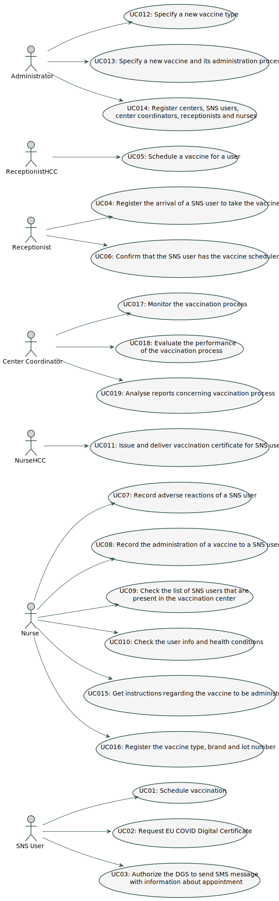

# Use Case Diagram (UCD)

**In the scope of this project, there is a direct relationship of _1 to 1_ between Use Cases (UC) and User Stories (US).**

However, be aware, this is a pedagogical simplification. On further projects and curricular units might also exist \_1 to N **and/or** N to 1 relationships between US and UC.

**Insert below the Use Case Diagram in a SVG format**

**For each UC/US, it must be provided evidences of applying main activities of the software development process (requirements, analysis, design, tests and code). Gather those evidences on a separate file for each UC/US and set up a link as suggested below.**

# Use Cases / User Stories

| UC/US  | Description                                                                                                                   |
| :----- | :---------------------------------------------------------------------------------------------------------------------------- |
| US 001 | [As a SNS user, I intend to use the application to schedule a vaccine.](US001.md)                                             |
| US 002 | [As a SNS user, I want to request the issuance of the EU COVID Digital Certificate.](US002.md)                                |
| US 003 | [As a SNS User, I want to authorize the DGS to send SMS message with information about appointment.](US003.md)                |
| US 004 | [As a receptionist, I want to register the arrival of a SNS user to take the vaccine.](US004.md)                              |
| US 005 | [As a receptionist, I want to schedule a vaccine for a SNS user.](US005.md)                                                   |
| US 006 | [As a receptionist, I want to confirm that the SNS user has the vaccine scheduled.](US006.md)                                 |
| US 007 | [As a nurse, I intend to record adverse reactions of a SNS user.](US007.md)                                                   |
| US 008 | [As a nurse, I want to record the administration of a vaccine to a SNS user.](US008.md)                                       |
| US 009 | [As a nurse, I want to check the list of SNS users that are present in the vaccination center to take the vaccine.](US009.md) |
| US 010 | [As a nurse, I want to check the info and health conditions of a SNS user.](US010.md)                                         |
| US 011 | [As a nurse, I want to issue and deliver vaccination certificate for a SNS user.](US011.md)                                   |
| US 012 | [As an administrator, I intend to specify a new vaccine type.](US012.md)                                                      |
| US 013 | [As an administrator, I intend to specify a new vaccine and its administration process.](US013.md)                            |
| US 014 | [As an administrator, I want to register centers, SNS users, center coordinators, receptionists and nurses.](US014.md)        |
| US 015 | [As a nurse, I want to get instructions regarding the vaccine to be administered.](US015.md)                                  |
| US 016 | [As a nurse, I want to register the vaccine type, brand and lot number.](US016.md)                                            |
| US 017 | [As a center coordinator, I want to monitor the vaccination process.](US017.md)                                               |
| US 018 | [As a center coordinator, I want to evaluate the performance of the vaccination process.](US018.md)                           |
| US 019 | [As a center coordinator, I want to analyse reports concerning vaccination process.](US019.md)                                |
