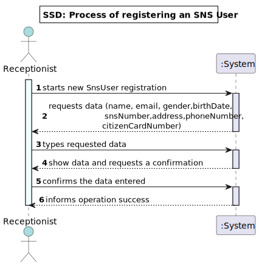
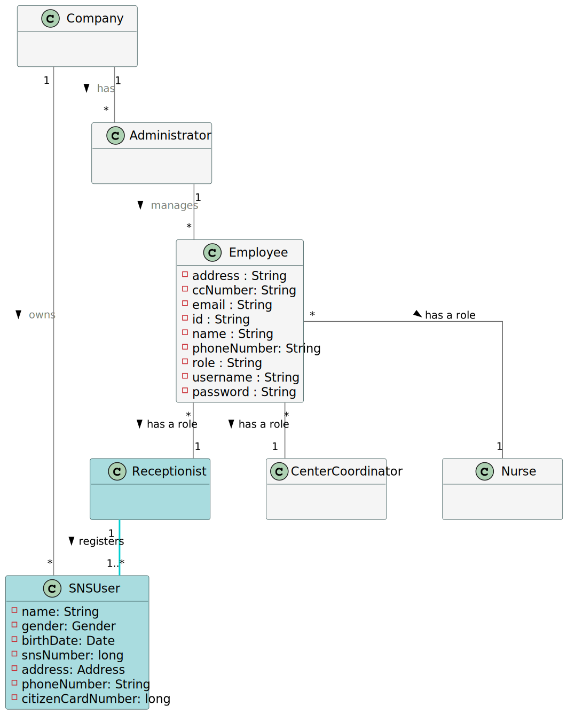
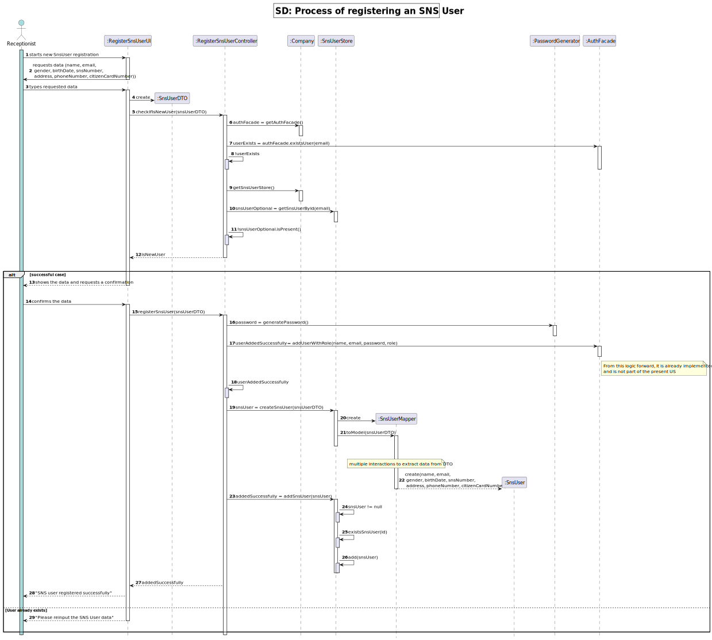
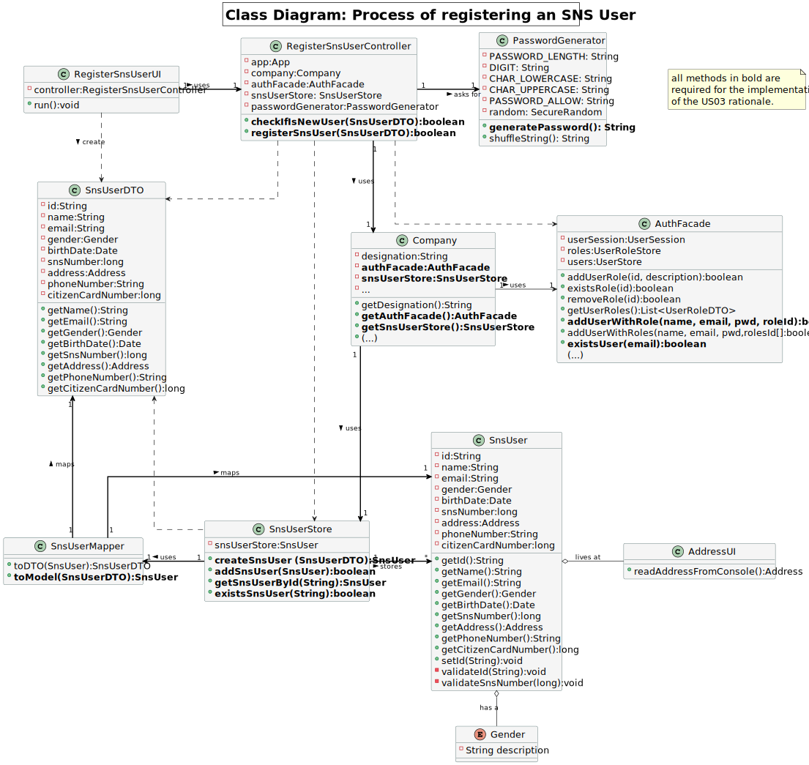

# US 03 - To register an SNS User

## 1. Requirements Engineering

### 1.1. User Story Description

As a receptionist, I want to register a SNS user.

### 1.2. Customer Specifications and Clarifications

*Insert here any related specification and/or clarification provided by the client together with **your interpretation**
. When possible, provide a link to such specifications/clarifications.*

**From the client specifications:**

-  A SNS user is a system user:  "An Administrator is responsible for properly configuring and managing the core information (...) required for this application to be operated daily by SNS users, nurses, receptionists, etc." 

 

-  Customer changed the role of administrator to the role of receptionist in SNS User registration.  " Any Administrator uses the application to register centers, SNS users,(...) enrolled in the vaccination process." 

 

**From the client clarifications:**

> - **Question:**
    In terms of the atributes that you have pointed out i would like to know the limit and rules of those atributes (EX:
    Phonenumber, birthdate,etc)?
>- **Answer:**
   *During Sprint B I will not introduce attribute rules/formats other than the ones that I already introduced (in this
   forum or in the project description). Please study the concepts and define appropriate formats for the attributes*

> - **Question:**
    How will the system user know their password, via email or a different way?
>- **Answer:**
   *I will not answer this question during Sprint B. I will not answer questions that require knowledge that will be
   introduced later, in the next sprints.*

> - **Question:**
    Regarding US3: "As a receptionist, I want to register an SNS User.", What are the necessary components in order to
    register an SNS User?"
>- **Answer:**
   *The attributes that should be used to describe a SNS user are: Name, Address, Sex, Phone Number, E-mail, Birth Date,
   SNS User Number and Citizen Card Number.*
   *The Sex attribute is optional. All other fields are required.*
   *The E-mail, Phone Number, Citizen Card Number and SNS User Number should be unique for each SNS user.*

> - **Question:**
    There we can read "US03 - As a receptionist, I want to register a SNS User."
    Accordingly, to our project description, the person allowed to register a SNS User it's the DGS Administrator".
> - **Answer:**
    *There is no error. We will have two User Stories for registering SNS users. One of these USs is US03 and the other
    US will be introduced later, in Sprint C.*
     

### 1.3. Acceptance Criteria

* **AC01:** The client must become a system user. The "auth" component available on the repository must be reused (
  without modifications).

  Users' authentication and authorization processes are reutilizing an external component called **_AuthLib_**.
  Documentation regarding this component is available [here](../../../Auth/README.md).

### 1.4. Found out Dependencies

- The existence of the receptionist user depends on the success of *US10 - As Administrator, I want register an
  Employee*

### 1.5 Input and Output Data

*Identity here the data to be inputted by the system actor as well as the output data that the system have/needs to
present in order to properly support the actor actions. Regarding the inputted data, it is suggested to distinguish
between typed data and selected data (e.g. from a list)*

|             | Description                                   | Comments                                                   |
|:------------|:----------------------------------------------|:-----------------------------------------------------------|
| Input Data  | Name  Sex                                     | Typed data: mandatory                                      |
|             | Address                                       | Typed data: mandatory                                      |
|             | Sex                                           | Typed data: Optional                                       |
|             | Phone Number                                  | Typed data: mandatory                                      |
|             | E-mail                                        | Typed data: mandatory                                      |
|             | Birth Date                                    | Typed data: mandatory                                      |
|             | SNS User Number                               | Typed data: mandatory                                      |
|             | Citizen Card Number                           | Typed data: mandatory                                      |
|             | SNS User Number                               | Typed data: mandatory                                      |
| Output Data | Confirm SNS user data (Y/N):                  | Confirmation message of SNS User typed data                |
|             | Please reinput the SNS User data.             | Insucess message of starts a SNS User registration process |
|             | Invalid SNS User, the SNS User already exists | Message for SNS User already registered                    |
|             | SNS user registered successfully              | Confirmation message of SNS User registration              |

### 1.6. System Sequence Diagram (SSD)

### 1.7 Other Relevant Remarks

> - Automatically generated password is required;

## 2. OO Analysis

### 2.1. Relevant Domain Model Excerpt

### 2.2. Other Remarks

> - Nothing to declare

## 3. Design - User Story Realization

### 3.1. Rationale

**The rationale grounds on the SSD interactions and the identified input/output data.**

| Interaction ID | Question: Which class is responsible for...                                | Answer                    | Justification (with patterns)                                                                                                                                                                                                                  |
|:---------------|:---------------------------------------------------------------------------|:--------------------------|:-----------------------------------------------------------------------------------------------------------------------------------------------------------------------------------------------------------------------------------------------|
| Step 1         | ... receiving the actor's actions?                                         | RegisterSnsUserUI         | **Pure Fabrication:** there is no reason to assign this responsibility to any existing class in the Domain Model                                                                                                                               |
| Step 2         | ... showing the required data to input?                                    | RegisterSnsUserUI         | **Pure Fabrication:**                                                                                                                                                                                                                          |                                                                                                                                                                                                                                                                            
| Step 3         | ... colecting the typed input data?                                        | RegisterSnsUserUI         | **Pure Fabrication:**                                                                                                                                                                                                                          |
|                | ... encapsulating the typed input data?                                    | SnsUserDTO                | **DTO:** When there is too much data to transfer, it is better to use a DTO in order to reduce coupling between UI and domain                                                                                                                  |
|                | ... coordinating the SNS User registration process?                        | RegisterSnsUserController | **Controller** This class is responsible for coordinating and distributing the actions performed on the User Interface (UI) to the domain layer (rest of the system)                                                                           |
|                | ... validating all system User data (local validation - attributes)?       | AuthFacade                | **IE:** cf. given A&A component documentation (Authface delegates that responsibility to the UserStore)                                                                                                                                        |
|                | ... validating all system User data (global validation - user uniqueness)? | AuthFacade                | **IE:** cf. given A&A component documentation (Authface delegates that responsibility to the UserStore)                                                                                                                                        |
|                | ... validating all SNS User data (local validation - attributes)?          | SnsUser                   | **IE:** a SnsUser knows its own data (the class that has the information necessary to fulfill the responsability)                                                                                                                              |
|                | ... validating all SNS User data (global validation - user uniqueness)?    | SnsUserStore              | **IE:** knows all the SNS Users                                                                                                                                                                                                                | 
| Step 4         | ... showing the typed data and requests confirmation?                      | RegisterSnsUserUI         | **Pure Fabrication:**                                                                                                                                                                                                                          |
| Step 5         | ... generating the password?                                               | PasswordGenerator         | **IE** and **Pure Fabrication:** To avoid code duplication (US10) this responsibility might be assigned to a common and shared artificial class, specialized in this task.                                                                     |
|                | ... registering the client as a system user?                               | AuthFacade                | **IE:** cf. given A&A component documentation                                                                                                                                                                                                  |                                                                                                                                                                                                                                                                  
|                | ... creating a new SNS User?                                               | SnsUserStore              | **Creator (SnsUserStore contains SnsUser)** and **HC+LC**: By the application of the Creator (B contains A) it would be the "Company". But, by applying HC + LC pattern to the Company, this delegates that responsibility to the SnsUserStore |                                                                                                                                                                                                                                               
|                | ... instantiating a new SNS User?                                          | SnsUserMapper             | **IE:** has the means to convert a DTO(SnsUserDTO) to a model object(SnsUser)                                                                                                                                                                  |                                                                                                                                                                                                
|                | ... saving the client?                                                     | SnsUserStore              | **IE:** Knows all clients                                                                                                                                                                                                                      |   
| Step 6         | ... informing operation success?                                           | RegisterSnsUserUI         | **IE:** is responsible for user interactions                                                                                                                                                                                                   |                           |                                                                                                                                                                                                                                                |

### Systematization ##

According to the taken rationale, the conceptual classes promoted to software classes are:
* Company
* SnsUser

Other software classes (i.e. Pure Fabrication) identified:

* RegisterSnsUserUI
* RegisterSnsUserController
* SnsUserStore
* SnsUserDTO
* SnsUserMapper
* PasswordGenerator

Other software classes of external systems/components already implemented:

* AuthFacade
* AuthUI
* AuthController

## 3.2. Sequence Diagram (SD)

## 3.3. Class Diagram (CD)

# 4. Tests

**Omitted** Outside the scope of ESOFT;

# 5. Construction (Implementation)

**Omitted** Outside the scope of ESOFT;

# 6. Integration and Demo

- A navigation menu for users with role receptionist was added;
- The SNS user registration process option was added to the receptionist navigation menu.

# 7. Observations

