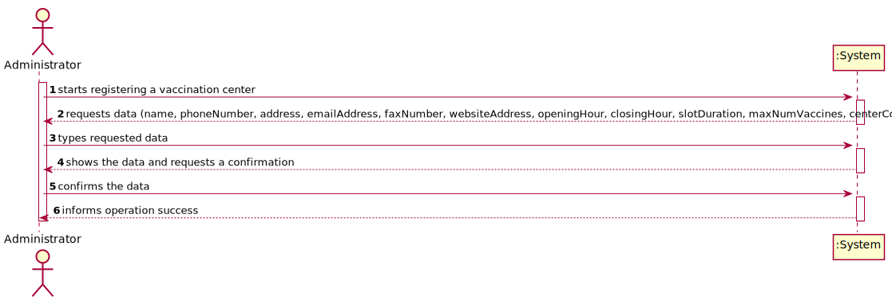
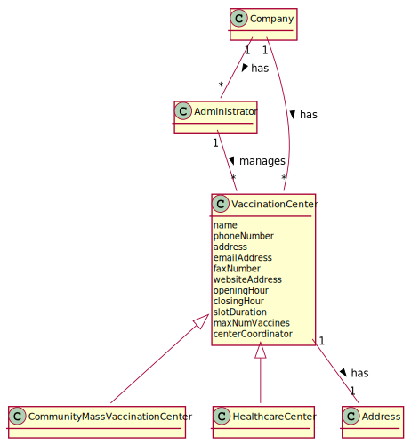
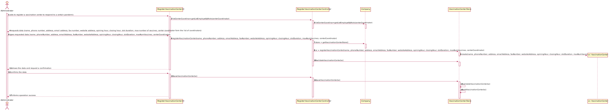
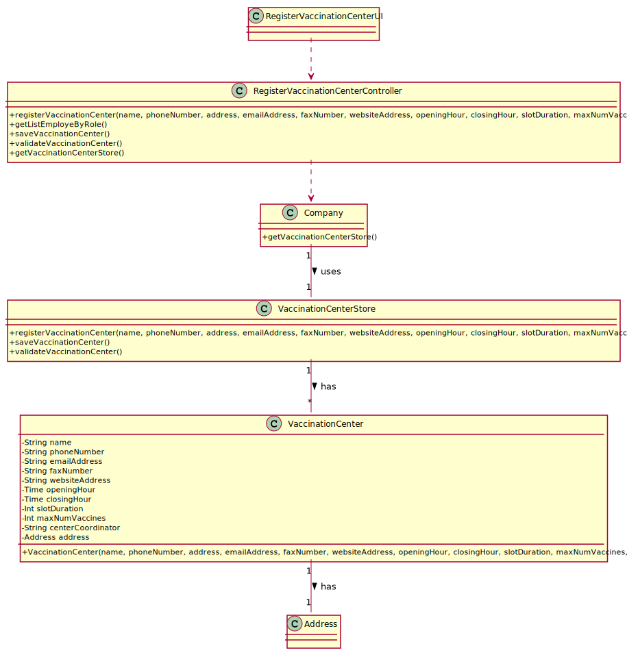

# US 009 - Register a vaccination center to respond to a certain pandemic

## 1. Requirements Engineering

### 1.1. User Story Description

As an administrator, I want to register a vaccination center to respond to a certain pandemic.

### 1.2. Customer Specifications and Clarifications

-  **From the specifications document:**

   -  "[...] Any Administrator uses the application to register centers, SNS users, [...]"
   -  "[...] vaccination centers are characterized by a name, an address, a phone number, an e-mail address, a fax number, a website address, opening and closing hours, slot duration (e.g.: 5 minutes) and themaximum number of vaccines that can be given per slot (e.g.: 10 accines per slot) [...]"
   -  "[...] each vaccination center has one coordinator [...]"

   
&nbsp;

-  **From the client clarifications:**

> **Question:** Regarding each center's schedule, I would like to know if the schedule varies for each day (week day and weekend for example) or if it's the same for everyday?
> I would also like to know if the slot duration and number of vaccines per slot varies by day or stays constant.
>
> **Answer:**

> **Question:** Regarding the opening and closing hours of the vaccination centers:
> Does the opening hour has to be a smaler number number than the closing hour (ex: opens at 8:00 and closes at 21:00), or can it also be have night hours (ex: opens at 20:00 and closes at 7:00)?
>
> **Answer:**

> **Question:** Vaccination centers have opening and closing hours, how would you like to set up these? Should it be like 'Mon-Fri 8am; Sat-Sun 10am' or simply 8am and we assume the hours do not vary for different days?
>
> **Answer:**

> **Question:** Which field can we use as a key to validate if a given vaccination center is already registered?
> Should we validate by email address?
>
> **Answer:**

> **Question:** Since the main difference between the two types of vaccination center (HealthCare Center and Community Mass Vaccination Center) is that the community mass vaccination centers are facilities specifically created to administer vaccines of a single type as response to an ongoing disease outbreak, should the system ask for the specific type of the vaccine on the creation of a Community Mass Vaccination Center?
>
> **Answer:**

> **Question:** 1. Are there any acceptance criteria on the creation of the vaccination centers, such as existence of duplicates (if the system should check if the typed information corresponds to an existing vaccination center). 2. Are there any acceptance criteria for the data such as number of digits, usual of specific characters.
>
> **Answer:**

> **Question:** As specified in the given user story: "As an administrator, I want to register a vaccination center to respond to a certain pandemic" when it is sad "to respond to a certain pandemic" is this referring only to the community mass vaccination centers or also to the healthcare centers?
>
> **Answer:**

> **Question:** Should the application be dynamic to the point that the Company decides how many types of centers exist? Or should we assume that all companies/organizations/healthcare systems that use our application have two and only two types of vaccination centers (community mass vaccination centers and health care centers)?
>
> **Answer:**

> **Question:** Is there any specification about the phone number and fax (for example: phone number has 9 digits), website, e-mail and name (specifications about length or type).
>
> **Answer:**

> **Question:** Regarding each center's schedule, I would like to know if the schedule varies for each day (week day and weekend for example) or if it's the same for everyday.
> I would also like to know if the slot duration and number of vaccines per slot varies by day or stays constant.
>
> **Answer:**

### 1.3. Acceptance Criteria

-  None;

### 1.4. Found out Dependencies

-  There is a dependency to "US10 register an Employee" since the center coordinators have to be registered in the system so can be selected at the time of the registration of the vaccination center.

### 1.5 Input and Output Data

**Input Data:**

-  Typed data:
   -  name
   -  phone number
   -  address
   -  email address
   -  fax number
   -  website address
   -  opening hours
   -  closing hours
   -  slot duration
   -  max number of vaccines
-  Selected data:
   -  center coordinator

**Output Data:**

-  Success of the operation

### 1.6. System Sequence Diagram (SSD)

### 1.7 Other Relevant Remarks

No other relevant remarks.

## 2. OO Analysis

### 2.1. Relevant Domain Model Excerpt

### 2.2. Other Remarks

No other relevant remarks.

## 3. Design - User Story Realization

### 3.1. Rationale

| Interaction ID | Question: Which class is responsible for...                        | Answer                              | Justification (with patterns)                                                                                 |
| :------------- | :----------------------------------------------------------------- | :---------------------------------- | :------------------------------------------------------------------------------------------------------------ |
| Step 1         | ... interacting with the actor?                                    | RegisterVaccinationCenterUI         | Pure Fabrication: there is no reason to assign this responsibility to any existing class in the Domain Model. |
|                | ... coordinating the US?                                           | RegisterVaccinationCenterController | Controller                                                                                                    |
|                | ... register a new vaccination center?                             | Company                             | Creator (Rule 1): in the DM Company has Vaccination Centers.                                                  |
| Step 2         | ... get a list of center coordinators                              | Company                             | IE: Knows all the center coordinators                                                                         |
| Step 3         | ... request data (i.e., name, phone number, address...)            | n/a                                 |                                                                                                               |
| Step 4         | ... validating the data locally (e.g.:mandatory vs non-mandadory)? | VaccinationCenterStore              | IE: knows its own data                                                                                        |
|                | ... validating the data globally (e.g.:duplicated)?                | VaccinationCenterStore              | IE: kowns all its vaccination centers.                                                                        |
| Step 5         | ... shows the data and request confirmation                        | RegisterVaccinationCenterUI         | IE: is responsible for user interactions.                                                                     |
| Step 6         | ... saving the created vaccination center?                         | VaccinationCenterStore              | IE: kowns all its vaccination centers.                                                                        |
| Step 7         | ... informing operation success?                                   | RegisterVaccinationCenterUI         | IE: is responsible for user interactions.                                                                     |

### Systematization

According to the taken rationale, the conceptual classes promoted to software classes are:

-  Company
-  VaccinationCenter

Other software classes (i.e. Pure Fabrication) identified:

-  RegisterVaccinationCenterUI
-  RegisterVaccinationCenterController
-  VaccinationCenterStore

## 3.2. Sequence Diagram (SD)

## 3.3. Class Diagram (CD)

# 4. Tests

n/a

# 5. Construction (Implementation)

n/a

# 6. Integration and Demo

n/a

# 7. Observations

n/a
