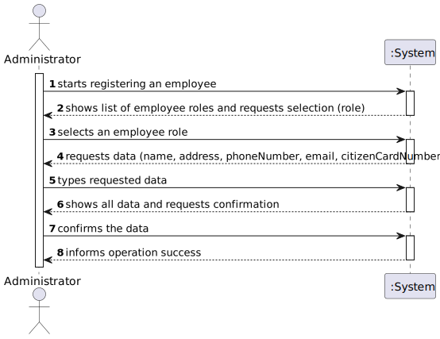
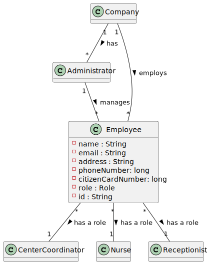
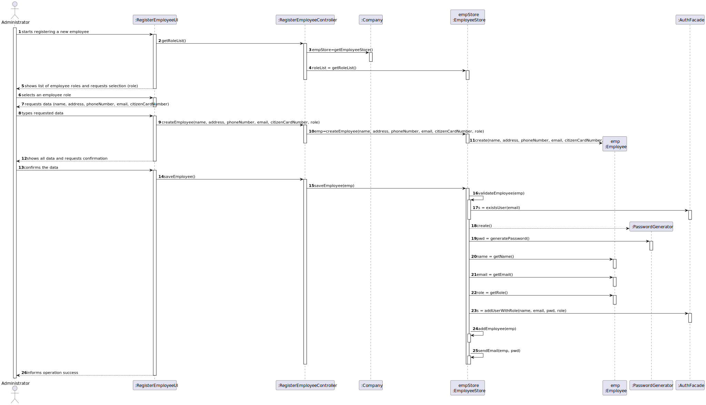
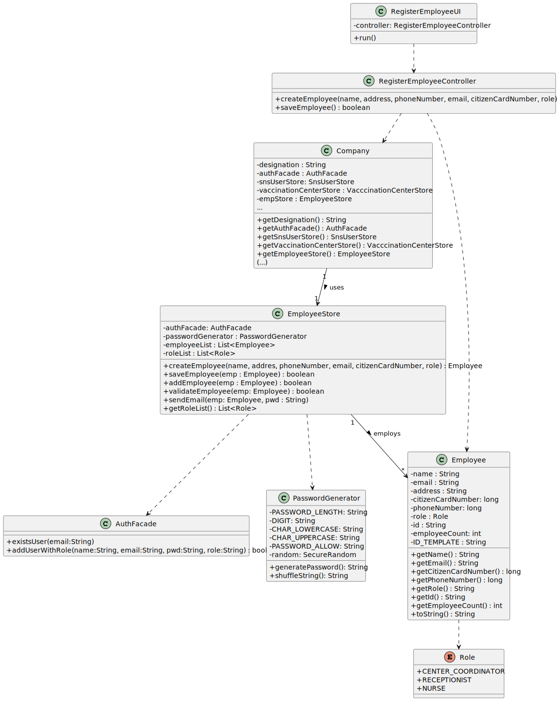

# US 010 - Register an employee

## 1. Requirements Engineering
### 1.1. User Story Description

As an administrator, I want to register an employee.

### 1.2. Customer Specifications and Clarifications 

**From the Specifications Document:**

> "An Administrator is responsible for properly configuring and managing the core information (e.g.: type of vaccines, vaccines, vaccination centers, **employees**) [...]."

> "[...]. Any Administrator uses the application to register centers, SNS users, **center coordinators, receptionists, and nurses** enrolled in the vaccination process."

**From the client specifications:**

> **Question**
>1. What is the correct format for the employee's phone number and cc? Should we consider that these follow the portuguese format?
>2. Is the password generated automatically, or is it specified by the user operating the system? 
>
> **Answer**
>1. Consider that these two attributes follow the portuguese format;
>2. The password should be generated automatically.

> **Question**: Besides a password and a user name, what other (if any) information should the Admin use to register a new employee? Are any of them optional?
>
> **Answer**: Every Employee has only one role (Coordinator, Receptionist, Nurse).
Employee attributes: Id (automatic), Name, address, phone number, e-mail and Citizen Card number.
All attributes are mandatory.
    
> **Question**: Is the Admin an Employee of a certain(s) Vaccination Center(s)? Or it's just an external entity that has stated responsibilities but it's not connected with the Employee's "crew"?
>
> **Answer**: The Administrator is the application administrator that ensures the proper functioning of application used by the DGS organization.
    
> **Question**: Can these employees work only in vaccination centers or can they work in any center (vaccination center and healthcare center), knowing that the healthcare centers also administer vaccines?
>    
> **Answer**: They can work in any center.

### 1.3. Acceptance Criteria

- AC1: password must have at least seven alphanumeric characters including three capital letters and two digits;
- AC2: employee phone number and citizen card number must follow portuguese format;

### 1.4. Found out Dependencies

No dependencies found.

### 1.5 Input and Output Data

**Input Data**

* Typed data:
    * address;
    * citizen card number;
    * email;
    * name;
    * phone number;
* Selected data:
  * role (Center Coordinator, Nurse, Receptionist);

**Output Data**

- (In)Success of the employee registering operation.

### 1.6. System Sequence Diagram (SSD)

### 1.7 Other Relevant Remarks

No other relevant remarks.

## 2. OO Analysis

### 2.1. Relevant Domain Model Excerpt 

## 3. Design - User Story Realization 

### 3.1. Rationale

**The rationale grounds on the SSD interactions and the identified input/output data.**

| Interaction ID | Question: Which class is responsible for... | Answer  | Justification (with patterns)  |
|:-------------  |:--------------------- |:------------|:---------------------------- |
| Step 1: starts registering an employee | ... interacting with the actor?  | RegisterEmployeeUI | Pure Fabrication: there is no reason to assign this responsibility to any existing class in the Domain Model. |
|       		 | ... getting role list?  | RegisterEmployeeController | Controller   |
| Step 2: shows list of employee roles and requests selection (role) | ... showing data to the user?	 | RegisterEmployeeUI | IE: responsible for user interactions |
| Step 3: selects an employee role |  ... asking for user input/option selection? | RegisterEmployeeUI | IE: responsible for user interactions |
| Step 4: requests data (name, address, phoneNumber, email, citizenCardNumber)  |	n/a |    |    |
| Step 5: types requested data |  ... instantiating a new Employee object | EmployeeStore | Creator: R1/2  |              
|                              |  ... saving the input data? | Employee | IE: the Employee objects records its own data |
| Step 6: shows all data and requests confirmation | ... asking for user confirmation? | RegisterEmployeeUI | IE: responsible for user interaction |
| Step 7: confirms the data | ... saving the created employee? | EmployeeStore | IE: EmployeeStore records all Employee objects |
|                           | ... checking for user duplication?  | AuthFacade | IE: AuthFacade records all users in the system |
|                           | ... instantiating a new PasswordGenerator object? | EmployeeStore | Creator: R2 |
| Step 8: informs operation success | ... informing operation success? | RegisterEmployeeUI  | IE: responsible for user interaction |

### Systematization ##

According to the taken rationale, the conceptual classes promoted to software classes are: 

 * Company
 * Employee

Other software classes identified: 
 * RegisterEmployeeUI (Pure fabrication)
 * RegisterEmployeeController (Pure fabrication)
 * EmployeeStore (Pure fabrication, HC+LC)
 * PasswordGenerator
 * Role

## 3.2. Sequence Diagram (SD)

## 3.3. Class Diagram (CD)

# 4. Tests 
n/a

# 5. Construction (Implementation)
n/a

# 6. Integration and Demo 

n/a
# 7. Observations

n/a

