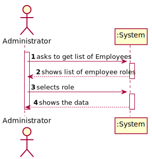
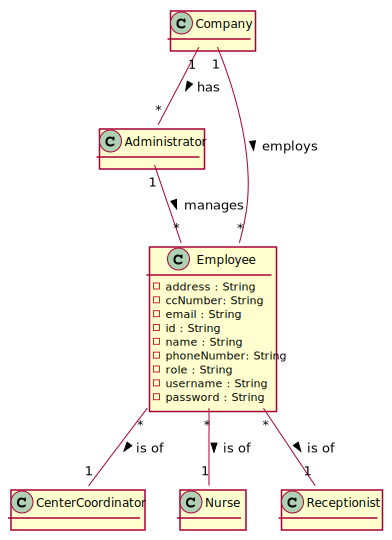
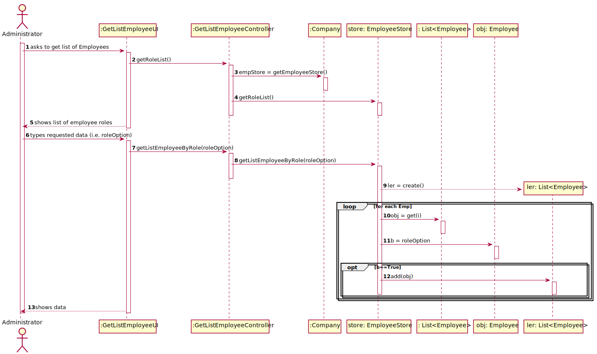
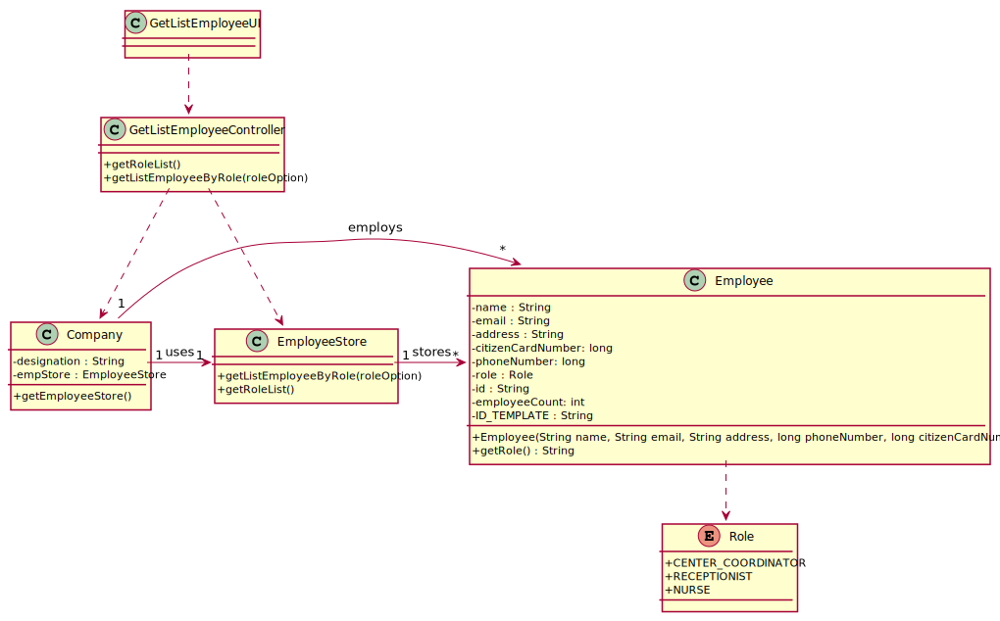

# US 011 - List of Employees with a given funtion 

## 1. Requirements Engineering
### 1.1. User Story Description

As an administrator, I want to get a list of Employees with a given function role.

### 1.2. Customer Specifications and Clarifications 

- **From the Specifications Document:**

>    - “[...] nurses working in the healthcare centers can issue and deliver on site a vaccination certificate [...]”

>    - “[...] Some users (e.g.: older ones) may want to go to a healthcare center to schedule the vaccine appointment with the help of a receptionists [...]”

>    - “[...] receptionist registers the arrival of the user to take the respective vaccine [...] “

>    - “[...] nurse responsible for administering the vaccine [...]”

>    - “[...] nurse checks the user info and health conditions in the system [...]”

>    - “[...] After giving the vaccine to the user, each nurse registers the event in the system [...]”

>    - “[...] Center Coordinator that has the responsibility to manage the Covid-19 vaccination process [...]”

  
- **From the client specifications:**

>  - Question: Should we give the user the possibility of listing employees from more than 1 role?
>
>    - Answer: The Administrator should select a given role and all employees associated with the selected role should be listed.
  
>  - Question: Should the list be sorted in any specific way(for example alphabetical name order) or should we give the option to sort by other characteristics?
>
>    - Answer: For now I just want to get a list of employees without considering the order of presentation
  
>  - Question: is tere any requirement or input that the Administrator must insert to get the list of the employees?
>  
>    - Answer: 
    
>  - Question: Should the administrator type the role he wants to see the list or select it from a list of existent roles?
  Also, is function the same thing as a role? If not, what is it?

>    - Answer:

>  - Question: Does the list of employees have any relevance on the functionality of the application? 

>    - Answer:

>  - Question: The list of employees to be got by the admin is per vaccination center, isn't it?
>  - Are there other filters that we should consider to get the list? For example, the admin would only like to see a list with only nurses for all vaccination centers, only the coordinators, etc...
    
>    - Answer: 
  
>  - Question: Should we assume SNSUsers must also appear on that list?

>    - Answer: ...the SNS user is not an Employee

>  - Question: Besides the name of the employee, what other attributes do we need to show on the list? Can we show every single attribute, including password and username?

>    - Answer: The application should present all Employee attributes. Password is not an Employee attribute.

  
### 1.3. Acceptance Criteria

- None;

### 1.4. Found out Dependencies

There is a dependency with “US10”, the list will be updated if there is new registration of the employee

### 1.5 Input and Output Data

**Input Data**

- Selected option : list of available roles of the employees

**Output Data**

- List with the data regarding employees by role

### 1.6. System Sequence Diagram (SSD)

### 1.7 Other Relevant Remarks

No other relevant remarks.

## 2. OO Analysis

### 2.1. Relevant Domain Model Excerpt 
*In this section, it is suggested to present an excerpt of the domain model that is seen as relevant to fulfill this requirement.* 

### 2.2. Other Remarks

*Use this section to capture some aditional notes/remarks that must be taken into consideration into the design activity. In some case, it might be usefull to add other analysis artifacts (e.g. activity or state diagrams).* 

## 3. Design - User Story Realization 

### 3.1. Rationale

**The rationale grounds on the SSD interactions and the identified input/output data.**

| Interaction ID                                     | Question: Which class is responsible for... | Answer            | Justification (with patterns)                                                                                |
|:---------------------------------------------------|:--------------------------------------------|:------------------|:-------------------------------------------------------------------------------------------------------------|
| Step 1 : asks to get list of Employees by role  		 | 	Interacting with the actor?						          | GetListEmployeeUI | Pure Fabrication: there is no reason to assign this responsibility to any existing class in the Domain Model |
| 		                                                 | 	get list of Employees by role?						       | EmployeeStore     | IE : knows the data                                                                                          |
| Step 2 : shows list of Employee roles	             | 	shows the list of roles?						             | EmployeeStore     | IE : knows the data                                                                                          |
| Step 3 : selects role	                             | 	n/a					                                   |                   |                                                                                                              |
| Step 4 : shows the data 		                         | 	showing the data?						                    | GetListEmployeeUI | IE : responsible for user interaction                                                                        |

### Systematization ##

According to the taken rationale, the conceptual classes promoted to software classes are: 

 * Company
 * Employee

Other software classes (i.e. Pure Fabrication) identified: 

 * GetListEmployeeUI  
 * GetListEmployeeController
 * EmployeeStore

## 3.2. Sequence Diagram (SD)

## 3.3. Class Diagram (CD)

