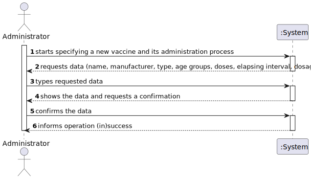
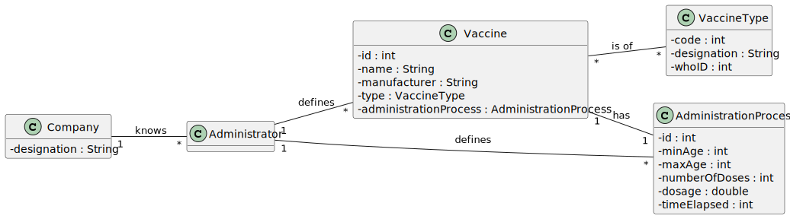
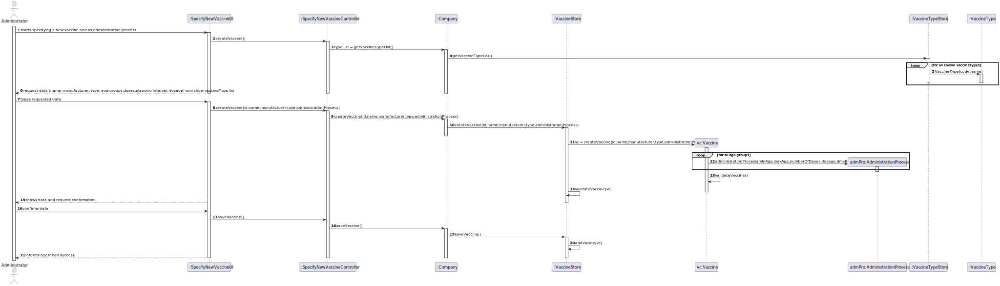
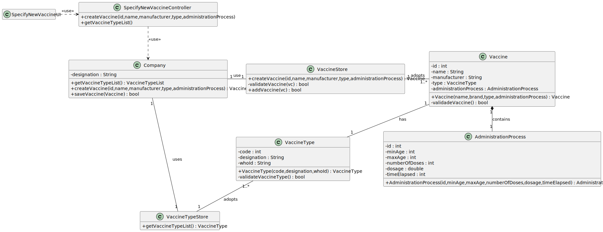

# US 013 - Specify New Vaccine and its Administration Process

## 1. Requirements Engineering

### 1.1. User Story Description

As an administrator, I intend to specify a new vaccine and its administration process.

### 1.2. Customer Specifications and Clarifications

**From the specifications document:**

> "(…)for each type of vaccine, several vaccines might exist,
> each one demanding a distinct administration process."

> "(…)The vaccine administration process comprises (i) one or
> more age groups (e.g.: 5 to 12 years old, 13 to 18 years old,
> greater than 18 years old), and (ii) per age group, the doses to
> be administered (e.g.: 1, 2, 3), the vaccine dosage (e.g.: 30 ml),
> and the time interval regarding the previously administered dose(…)"

> "(…)it is important to notice that between doses 
> (e.g.: between the 1st and 2nd doses) the dosage to be administered 
> might vary as well as the time interval elapsing between two consecutive
> doses (e.g.: between the 1st and 2nd doses 21 days might be required, 
> while between the 2nd and the 3rd doses 6 months might be required)(…)"

**From the client clarifications:**

> **Question:** We would like to know if when specifying a new Vaccine 
> and its Administration Process, should a list of the existing types of
> vaccines be displayed in order for him to choose one, or should he just 
> input it? 
>
> **Answer:** If the information is available in the system, it is a 
> good practice to present the information to the user and ask the user 
> to select.

> **Question:** As to the interval between doses, what time format are we
> to use? (e.g. days, weeks, months
>
> **Answer:** Number of days.

> **Question:** Each age group will have his own time interval regarding two doses as well as the dosage 
> to be administered in each dose?
>
> **Answer:** -

> **Question:** When specifying a Vaccine and its Administration Process, are there any rules for the following attributes?
-Name
-Id
-Brand
-Number of doses
-Dosage
>
> **Answer:** -

> **Question:** Is the recovery period the same through all types of vaccines, and vaccines, or does each vaccine have a
> certain recovery period? If each vaccine has a recovery period, is it different per age group and/or per dose?
>
> **Answer:** -

> **Question:** 1 - Is there any data that characterizes the vaccine administration process as well as business rules or 
> acceptance criteria related to that data?
2 - Can the vaccine administration process only be registered simultaneously with the creation 
> of the vaccine or can it be added later?
>
> **Answer:** -

> **Question:** Regarding the US13 (Specify a new vaccine and its administration process) is there more data that 
> should be inserted besides the number of doses of the vaccine and the necessary time between doses?
>
> **Answer:** -
 

### 1.3. Acceptance Criteria

* None

### 1.4. Found out Dependencies

* There is a dependency to "US012 - Specify New Vaccine Type" since the 
type of vaccine is an attribute of the new vaccine to be created.

### 1.5 Input and Output Data

**Input Data:**

* Typed data:
    * a vaccine's name,
    * a vaccine's manufacturer
    * a vaccine's number of age groups
    * age group's lower bound
    * age group's upper bound
    * age group's number of vaccines doses
    * age group's dosage
    * age group's elapsed time between doses

* Selected option:
    * Vaccine's type

**Output Data:**

* (In)Success of the operation

### 1.6. System Sequence Diagram (SSD)

### 1.7 Other Relevant Remarks

* No other relevant trademarks.

## 2. OO Analysis

### 2.1. Relevant Domain Model Excerpt

### 2.2. Other Remarks

* No other relevant trademarks.

## 3. Design - User Story Realization

### 3.1. Rationale

| Interaction ID | Question: Which class is responsible for...               | Answer                      | Justification (with patterns)                                                                                 |
| :------------- | :---------------------                                    | :------------               | :----------------------------                                                                                 |
| Step 1         | ... interacting with the actor?                           | SpecifyNewVaccineUI         | Pure Fabrication: there is no reason to assign this responsibility to any existing class in the Domain Model. |
| Step 2         | ... create a new vaccine?                                 | SpecifyNewVaccineController | Controller: non-user interface object responsible for handling this system event.                             |
| Step 3         | ... get vaccine type list?                                | Company                     | Creator (Rule 1): Company will be responsble because the facade controller has too many events.               |
| Step 4         | ... get vaccine Type list?                                | VaccineTypeStore            | IE: has all the information, with the registry of all vaccine types.                                          |
| Step 5         | ... reading vaccine Type attributes?                      | VaccineType                 | IE: has all the information related to the vaccine types.                                                     |
| Step 6         | ... request data from the actor?                          | SpecifyNewVaccineUI         | IE: responsible for user interaction.                                                                         |
| Step 7         | ... receiving data from the actor?                        | SpecifyNewVaccineUI         | IE: responsible for user interaction.                                                                         |
| Step 8         | ... create a new vaccine?                                 | SpecifyNewVaccineController | Controller: non-user interface object responsible for handling this system event.                             |
| Step 9         | ... create a new vaccine?                                 | Company                     | Creator (Rule 1): Company will be responsble because the facade controller has too many events.               |
| Step 10        | ... create a new vaccine?                                 | VaccineStore                | IE: has all the information, with the registry of all vaccine.                                                |
| Step 11        | ... create a new vaccine?                                 | Vaccine                     | Creator (Rule 2): Vaccine has its own constructor.                                                            |
| Step 12        | ... creating a new administration process?                | AdministrationProcess       | Creator (Rule 2): Administration Process creates its own.                                                     |
| Step 13        | ... validating all vaccine's data (local validation)?     | Vaccine                     | IE: has all the information.                                                                                  |
| Step 14        | ... validating all vaccine's data (global validation)?    | Vaccine                     | IE: has all the information.                                                                                  |
| Step 15        | ... shows the data to the actor and request confirmation? | SpecifyNewVaccineUI         | IE: responsible for user interaction.                                                                         |
| Step 16        | ... receiving the confirmation from the actor?            | SpecifyNewVaccineUI         | IE: responsible for user interaction.                                                                         |
| Step 17        | ... saving the vaccine?                                   | SpecifyNewVaccineController | Controller: non-user interface object responsible for handling this system event.                             |
| Step 18        | ... saving the vaccine?                                   | Company                     | Creator (Rule 1): Company will be responsible because the facade controller has too many events.              |
| Step 19        | ... saving the vaccine?                                   | VaccineStore                | IE: has all the information, with the registry of all vaccine.                                                |
| Step 20        | ... add the vaccine to the database?                      | VaccineStore                | IE: has all the information, with the registry of all vaccine.                                                |
| Step 21        | ... informs operation (in)success to the actor?           | SpecifyNewVaccineUI         | IE: responsible for user interaction.                                                                         |

### Systematization ##

According to the taken rationale, the conceptual classes promoted to software classes are:

* Company
* Vaccine
* Vaccine Type
* Administration Process

Other software classes (i.e. Pure Fabrication) identified:

* SpecifyNewVaccineUI
* SpecifyNewVaccineController
* VaccineStore
* VaccineTypeStore

## 3.2. Sequence Diagram (SD)

## 3.3. Class Diagram (CD)

# 4. Tests

* None

# 5. Construction (Implementation)

## Class CreateTaskController

* None

## Class Organization

* None

# 6. Integration and Demo

* None

# 7. Observations

* None

