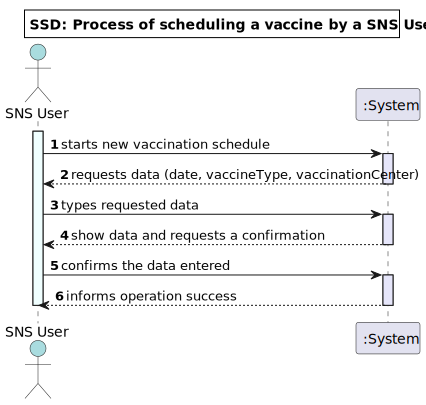
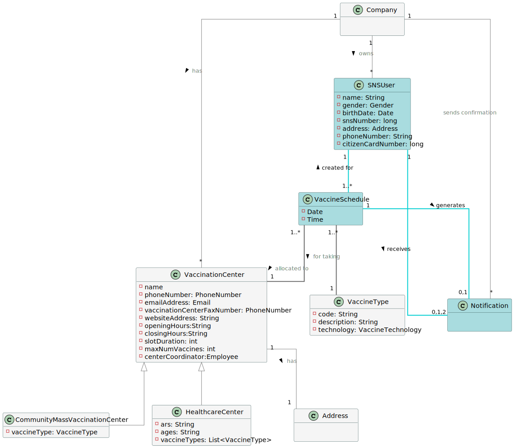
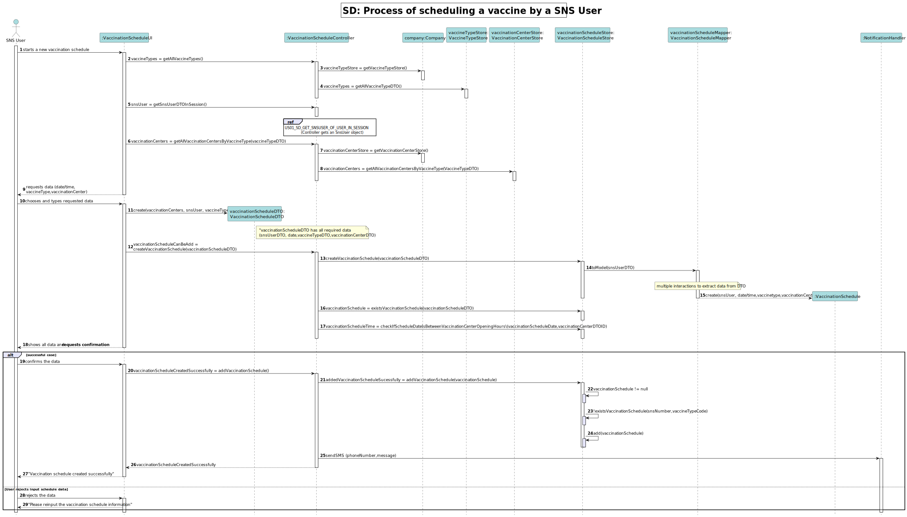
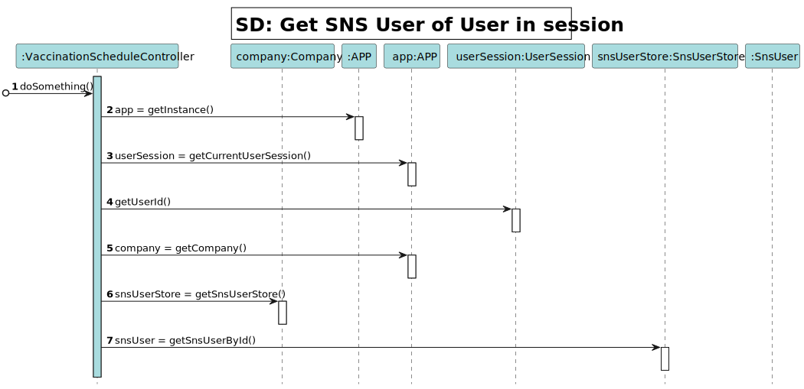
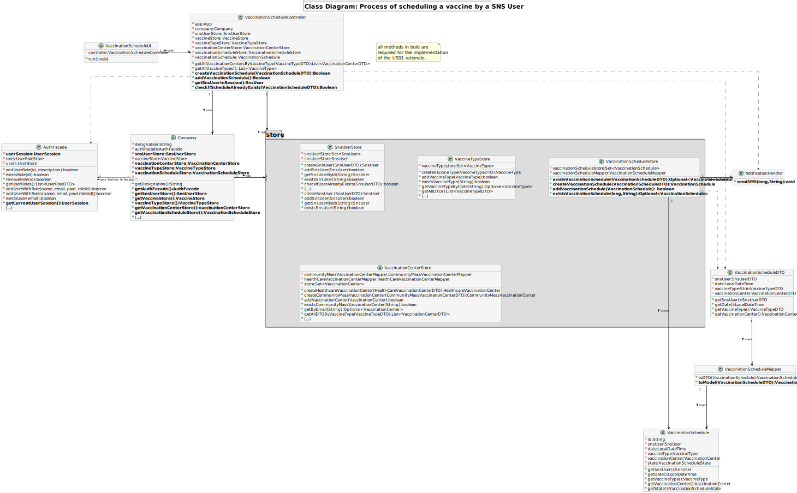

# US 01 - To Schedule a Vaccine

## 1. Requirements Engineering

### 1.1. User Story Description

As a Sns User, I intend to use the application to schedule a vaccine.

### 1.2. Customer Specifications and Clarifications

**From the client specifications:**

-    "To take a vaccine, the SNS user should use the application to schedule his/her vaccination. The user should introduce his/her SNS user number, select the vaccination center, the date, and the time (s)he wants to be vaccinated as well as the type of vaccine to be administered (by default, the system suggests the one related to the ongoing outbreak). Then, the application should check the vaccination center capacity for that day/time and, if possible, confirm that the vaccination is scheduled and inform the user that (s)he should be at the selected vaccination center at the scheduled day and time. The SNS user may also authorize the DGS to send a SMS message with  information about the scheduled appointment."  

**From the client clarifications:**

| **Update Acceptance Criteria (US1 e US2):**                                                                                                                                                                                                                                                                                         |
|-------------------------------------------------------------------------------------------------------------------------------------------------------------------------------------------------------------------------------------------------------------------------------------------------------------------------------------|
| *The acceptance criteria for US1 and US2 are:*                                                                                                                                                                                                                                                                                      |
| *a. A SNS user cannot schedule the same vaccine more than once.*                                                                                                                                                                                                                                                                    |
| *b. The algorithm should check if the SNS User is within the age and time since the last vaccine".*                                                                                                                                                                                                                                 |
|                                                                                                                                                                                                                                                                                                                                     |
| *This means:*                                                                                                                                                                                                                                                                                                                       |
| *a. At a given moment, the SNS user cannot have more than one vaccine (of a given type) scheduled;*                                                                                                                                                                                                                                 |
| *b. The algorithm has to check which vaccine the SNS user took before and check if the conditions (age and time since the last vaccine) are met. If the conditions are met the vaccination event should be scheduled and registered in the system. When scheduling the first dose there is no need to check these conditions.*      |
|                                                                                                                                                                                                                                                                                                                                     |
| **Taking into account the mismatch of the US2 acceptance criteria, the client dispenses the application of the point b. acceptance criteria in the sprint C**                                                                                                                                                                       |
| **Client:** *"We can always prepare a system for these two acceptance criteria. Even so, as we are in the final stage of Sprint C, we will drop the acceptance criteria b ( The algorithm should check if the SNS User is within the age and time since the last vaccine). This acceptance criteria will be included in Sprint D."* |

> **1 . Question:**
    *The project description says "To take a vaccine, the SNS user should use the application to schedule his/her vaccination. The user should introduce his/her SNS user number, select the vaccination center, the date, and the time(s)he wants to be vaccinated as well as the type of vaccine to be administered [...].
    Does the user have to enter the date and time they want or does the system have to show the available dates and times for the user to select?*
>   - **Answer:**
      *In this sprint the actor should introduce (using the keyboard) the date and time (s)he wants to be vaccinated.*

>
> **2. Question:**
    *Are we allowed to create an attribute of vaccine type in CMVC object?*
>   - **Answer:**
>     *Please study ESOFT and discuss this issue with ESOFT teachers.*
> 

> **3. Question:**
    *For the US1, the acceptance criteria is: A SNS user cannot schedule the same vaccine more than once. For the US2, the acceptance criteria is:
>    The algorithm should check if the SNS User is within the age and time since the last vaccine.
>   - [1] Are this acceptance criteria exclusive of each US or are implemented in both?
>   - [2] To make the development of each US more clear, could you clarify the differences between the two US?*
>
>   - **Answer:**
>     - *1- The acceptance criteria for US1 and US2 should be merged.* 
>     *The acceptance criteria por US1 and US2 is: A SNS user cannot schedule the same vaccine more than once. The algorithm should check if the SNS User is within the age and time since the last vaccine.*
    
>     - *2- In US1 the actor is the SNS user, in US2 the actor is the receptionist. In US1 the SNS user is already logged in the system and information that
>     is required and that exists in the system should be automatically obtained. In US2 the receptionist should ask the SNS user for the information needed to schedule a vaccination. Information describing the SNS user should be automatically obtained by introducing the SNS user number.*
>

> **4. Question:**
    *We are unsure if it's in this user stories that's asked to implement the "send a SMS message with
>    information about the scheduled appointment" found on the Project Description available in moodle. Could you clarify?*
>   - **Answer:**
>     *In a previous clarification that I made on this forum, I said: "[The user should receive a] SMS Message to warn of a scheduling [and the message] should include: Date, Time and vaccination center". Teams must record the answers!
      A file named SMS.txt should be used to receive/record the SMS messages. We will not use a real word service to send SMSs.*

> **5. Question:**
>   *Regarding the US01 - Should the app ask for the location where the SNS User would like to take his vaccine or should it rather suggest a vaccination
>   center for the SNS User to go, based on the timetable chosen by the SNS User?*
>   - **Answer:**
>     *The application should ask for a location where the SNS User wants to take the vaccine.*

> **6. Question:**
>   *I would like to ask if you could tell me if my interpretation of this US was correct.So my interpretation was that the receptionist
>   should choose a vaccination center and than in that vaccination center she would schedule the second dosage of the vaccine*
>   - **Answer:**
>     *The goal of this US is to schedule a vaccination for a SNS user. The SNS user should go to a vaccination center and a receptionist should use the application to schedule a vaccination for the SNS user. The receptionist should ask the SNS user for data required to schedule a vaccination.
>     The data needed to schedule a vaccination is the same required in US01. Please check the Project Description available in moodle.*
>   

### 1.3. Acceptance Criteria

**AC01:** Acceptance criteria: A SNS user cannot schedule the same vaccine more than once;

### 1.4. Found out Dependencies

- The existence of the SNS User depends on the success of **US3: As a receptionist, I want to register a SNS user**
- The existence of the Vaccination Centers list depends on the success of **US9: As an administrator, I want to register a vaccination center to respond to a certain
  pandemic.**
- The existence of the Vaccine type list depends on the success of **US12: As an administrator, I intend to specify a new vaccine type**

### 1.5 Input and Output Data

*Identity here the data to be inputted by the system actor as well as the output data that the system have/needs to
present in order to properly support the actor actions. Regarding the inputted data, it is suggested to distinguish
between typed data and selected data (e.g. from a list)*

|             | Description                                                           | Comments                                                    |
|:------------|:----------------------------------------------------------------------|:------------------------------------------------------------|
| Input Data  | Date and time                                                         | Typed data: mandatory                                       |
|             | Vaccine Type                                                          | Typed data: mandatory                                       |
|             | Vaccination Center                                                    | Typed data: mandatory                                       |
| Output Data | Confirm SNS user data (Y/N):                                          | Confirmation message of vaccination typed and selected data |
|             | Reinput the vaccination schedule information (Y/N)?                   | Insucess message of starts a SNS User registration process  |
|             | Invalid vaccination schedule, the vaccination schedule already exists | Message for vaccine schedules already registered            |
|             | Vaccination schedule created successfully                             | Confirmation message of vaccine schedule                    |

### 1.6. System Sequence Diagram (SSD)

### 1.7 Other Relevant Remarks

> - Send a SMS message to SNS User with information about the scheduled appointment is required;

## 2. OO Analysis

### 2.1. Relevant Domain Model Excerpt

### 2.2. Other Remarks

> - Nothing to declare

## 3. Design - User Story Realization

### 3.1. Rationale

**The rationale grounds on the SSD interactions and the identified input/output data.**

| Interaction ID                                               | Question: Which class is responsible for...                                   | Answer                    | Justification (with patterns)                                                                                                                                                                                                                                                      |
|:-------------------------------------------------------------|:------------------------------------------------------------------------------|:--------------------------|:-----------------------------------------------------------------------------------------------------------------------------------------------------------------------------------------------------------------------------------------------------------------------------------|
| Step 1: starts new vaccination schedule                      | ... receiving the actor's actions?                                            | VaccinationScheduleUI     | **Pure Fabrication:** there is no reason to assign this responsibility to any existing class in the Domain Model                                                                                                                                                                   |
| Step 2: requests data (date, vaccineType, vaccinationCenter) | ... showing the required data to input?                                       | VaccinationScheduleUI     | **Pure Fabrication:**                                                                                                                                                                                                                                                              |                                                                                                                                                                                                                                                                            
| Step 3: types requested data                                 | ... colecting the typed input data?                                           | VaccinationScheduleUI     | **Pure Fabrication:**                                                                                                                                                                                                                                                              |
|                                                              | ... encapsulating the typed input data?                                       | VaccinationScheduleDTO    | **DTO:** When there is too much data to transfer, it is better to use a DTO in order to reduce coupling between UI and domain                                                                                                                                                      |
|                                                              | ... coordinating the vaccination scheduling process?                          | RegisterSnsUserController | **Controller** This class is responsible for coordinating and distributing the actions performed on the User Interface (UI) to the domain layer (rest of the system)                                                                                                               |
|                                                              | ... retrieving the User in session?                                           | AuthFacade                | **IE:** cf. given A&A component documentation                                                                                                                                                                                                                                      |
|                                                              | ... retrieving the SnsUser object?                                            | SnsUserStore              | **Creator (SnsUserStore contains SnsUser)** and **HC+LC**: By the application of the Creator (B contains A) it would be the "Company". But, by applying HC + LC pattern to the Company, this delegates that responsibility to the SnsUserStore                                     |
|                                                              | ... creating a new vaccination schecule?                                      | VaccinationScheduleStore  | **Creator (VaccinationScheduleStore contains VaccinationSchedule)** and **HC+LC**: By the application of the Creator (B contains A) it would be the "Company". But, by applying HC + LC pattern to the Company, this delegates that responsibility to the VaccinationScheduleStore |                                                                                                                                                                                                                                               
|                                                              | ... validating if vaccination schecule already exists?                        | VaccinationScheduleStore  | **IE:** Knows all vaccination schedules                                                                                                                                                                                                                                            |
|                                                              | ... validating if vaccination schecule date and time is within working hours? | VaccinationScheduleStore  | **IE:** Knows all vaccination schedule and has access to the information of their attributes                                                                                                                                                                                       |                                                                                                                                                                                                                                                                                    |
| Step 4: show data and requests a confirmation                | ... showing the typed data and requests confirmation?                         | VaccinationScheduleUI     | **Pure Fabrication**                                                                                                                                                                                                                                                               |
| Step 5: confirms the data entered                            | ... adding the vaccination schedule to the store?                             | VaccinationScheduleStore  | **IE:** Knows all clients                                                                                                                                                                                                                                                          |
|                                                              | ... validating if vaccination schecule is valid?                              | VaccinationScheduleStore  | **IE:** Knows all clients                                                                                                                                                                                                                                                          |   
|                                                              | ... sending the SMS notification?                                             | NotificationHandler       | **IE** and **Pure Fabrication:** To avoid code duplication (US02) this responsibility might be assigned to a common and shared artificial class, specialized in this task.                                                                                                         |
| Step 6: informs operation success                            | ... informing operation success?                                              | VaccinationScheduleUI     | **IE:** is responsible for user interactions                                                                                                                                                                                                                                       |                           |                                                                                                                                                                                                                                                |

### Systematization ##

According to the taken rationale, the conceptual classes promoted to software classes are:

* VaccineSchedule
* Notification

Other software classes (i.e. Pure Fabrication) identified:

* VaccinationScheduleUI
* VaccinationScheduleController
* VaccinationScheduleStore
* VaccinationScheduleDTO
* VaccinationScheduleMapper

Other software classes of external systems/components already implemented:

* AuthFacade
* AuthUI
* AuthController

## 3.2. Sequence Diagram (SD)

## 3.3. Class Diagram (CD)

# 4. Tests

**Omitted** Outside the scope of ESOFT;

# 5. Construction (Implementation)

**Omitted** Outside the scope of ESOFT;

# 6. Integration and Demo

- A navigation menu for users with role SNS User was added;
- The vaccine scheduling process option was added to the SNS User navigation menu.

# 7. Observations

> - Nothing to declare

