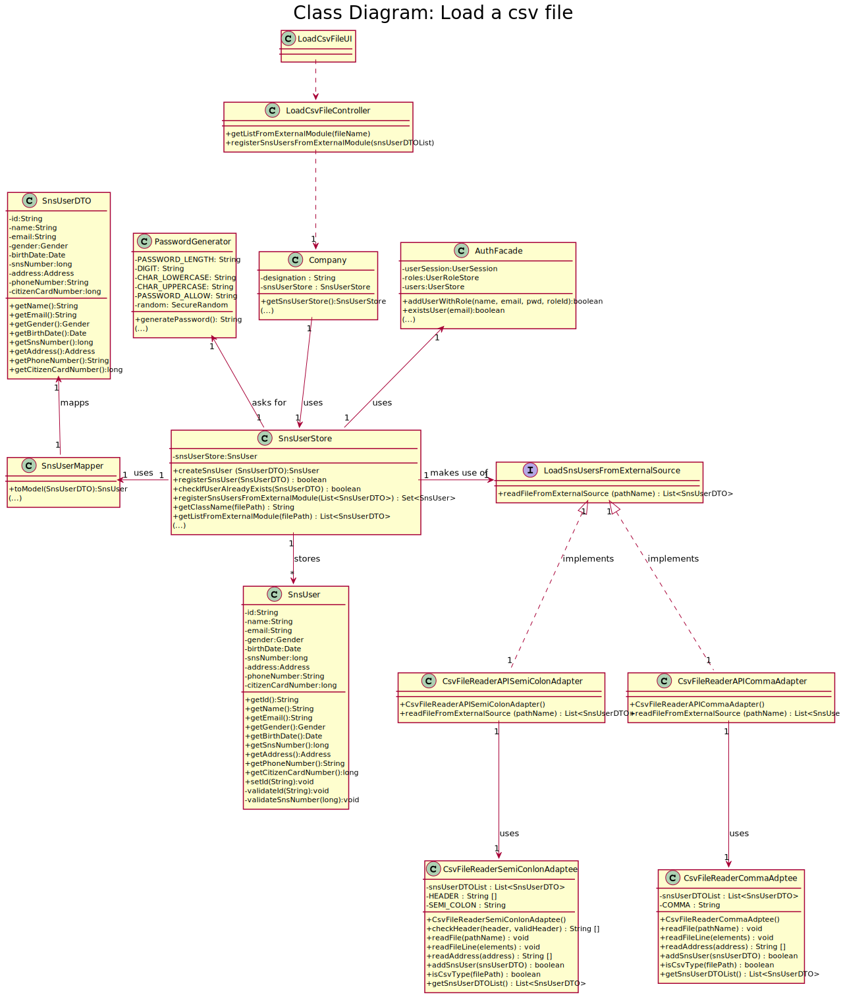

# US 014 - Load csv files of users

## 1. Requirements Engineering
### 1.1. User Story Description

As an administrator, I want to load a set of users from a CSV file.

### 1.2. Customer Specifications and Clarifications 

- **From the Specifications Document:**

>    - “[...] The DGS has Administrators who administer the application [...]”

>    - “[...] Any Administrator uses the application to register SNS users [...]”

- **From the client specifications:**

>  - Question: I would like to clarify if the CSV file only contains information about SNS users of if the CSV file may also contain some information about employees from that vaccination center
>
>    - Answer: The CSV file only contains information about SNS users.
  
>  - Question: What would be the sequence of parameters to be read on the CSV? For example: "Name | User Number".
>
>    - Answer: Name, Sex, Birth Date, Address, Phone Number, E-mail, SNS User Number and Citizen Card Number
  
>  - Question: When the admin wants to upload a CSV file to be read, should the file be stored at a specific location on the computer (e.g. the desktop) or should the admin be able to choose the file he wants to upload in a file explorer?
>  
>    - Answer: The Administrator should write the file path. In Sprint C we do not ask students to develop a graphical user interface.
    
>  - Question: Is it possible that the file can contain lines with incomplete information in some fields (e.g. N/A). If so, should we read those lines as well and leave those fields empty or shall we discard that complete line?

>    - Answer: CSV files that have errors should not be loaded. Opcional attributes may have a NA value.

>  - Question: In witch format will be given the date of birth (YYYY/MM/DD or DD/MM/YYYY)? 

>    - Answer: In a previous clarification I said: "The dates registered in the system should follow the Portuguese format (dd/mm/yyyy)".

>  - Question: Should our application detect if the CSV file to be loaded contains the header, or should we ask the user if is submitting a file with a header or not?

>    - Answer:The application should automatically detect the CSV file type.

>  - Question: Should we check if the users from the CSV file are already registered in the system? If so, which data should we use, the one already in the system or the one on the file?

>    - Answer: This feature of the system will be used to register a batch users. If the user is already registered in the system, then the information available in the CSV file should not be used to register that user.

>  - Question: What should the system do if the file to be loaded has information that is repeated? For example, if there are 5 lines that have the same information or that have the same attribute, like the phone number, should the whole file be discarded?

>    - Answer: If the file does not have other errors, all records should be used to register users. The business rules will be used to decide if all file records will be used to register a user.
       For instance, if all users in the CSV file are already registered in system, the file should be processed normally but no user will be added to the system (because the users are already in the system).

>  - Question: how should the admin receive the login data/passwords for all registered users?

>    - Answer: During this sprint, login and password data should be presented in the console application.
       In US14 the application is used to register a batch of users. For each user, all the data required to register a user should be presented in the console.

>  - Question: is there any specific format that should be validated for the address, or we can assume it is just of string type?
 
>    - Answer: The address contained in the CSV file is a string and should not contain commas or semicolons.

### 1.3. Acceptance Criteria

- The application must support importing two types of CSV
  files: 
  - a) one type must have a header, column separation is done using “;”
    character;
  - b) the other type does not have a header, column separation is done
    using “,” character.

### 1.4. Found out Dependencies

- Dependency with US-03

### 1.5 Input and Output Data

**Input Data**

- Selected option : Type the path file

**Output Data**

- Success of loading all the users (SnsUsers) on the application and display on the console.

### 1.6. System Sequence Diagram (SSD)

### 1.7 Other Relevant Remarks

No other relevant remarks.

## 2. OO Analysis

### 2.1. Relevant Domain Model Excerpt 
*In this section, it is suggested to present an excerpt of the domain model that is seen as relevant to fulfill this requirement.* 

### 2.2. Other Remarks

*Use this section to capture some aditional notes/remarks that must be taken into consideration into the design activity. In some case, it might be usefull to add other analysis artifacts (e.g. activity or state diagrams).* 

## 3. Design - User Story Realization 

### 3.1. Rationale

**The rationale grounds on the SSD interactions and the identified input/output data.**

| Interaction ID                                                     | Question: Which class is responsible for...                                               | Answer                                                            | Justification (with patterns)                                                                                                                                           |
|:-------------------------------------------------------------------|:------------------------------------------------------------------------------------------|:------------------------------------------------------------------|:------------------------------------------------------------------------------------------------------------------------------------------------------------------------|
| Step 1 : starts to load csv file  		                               | 	Interacting with the actor?						                                                        | LoadCsvFileUI                                                     | Pure Fabrication: there is no reason to assign this responsibility to any existing class in the Domain Model                                                            |
| Step 2 : requests the file path	                                   | 	Interacting with the actor?						                                                        | LoadCsvFileUI                                                     | Pure Fabrication: there is no reason to assign this responsibility to any existing class in the Domain Model                                                            |
| Step 3 : types the path	                                           | 	Receiving path from UI?					                                                             | LoadCsvFileController                                             | Controller: Acts an intermediary between the UI and the domain.                                                                                                         |
|                                                                    | 	Accessing to the information from the file?					                                         | LoadSnsUsersFromExternalSource                                    | Interface: Establish the connection of the domain model and the adpapter.                                                                                               |
| 	                                                                  | 	Reading the data in the file and converting in accordance with our system?				           | CsvFileReaderAPICommaAdapter CsvFileReaderAPISemiColonAdapter | Adapter : Each adapter is responsible for converting requests made in accordance with our system specification to requests in accordance with the intended external API |
|                                                                    | 	Stores the information of SnsUsers after reading from external file and validation?					 | SnsUserStore                                                      | IE: knows its own data                                                                                                                                                  |
|                                                                    | 	Retriving list of SnsUsers validated?					                                               | LoadCsvFileController                                             | Controller: Acts an intermediary between the UI and the domain.                                                                                                         |
| Step 4 : shows sucess message and information of registed users 		 | 	showing the message?						                                                               | LoadCsvFileUI                                                | IE: responsible for user interaction                                                                                                                                    |

### Systematization ##

According to the taken rationale, the conceptual classes promoted to software classes are: 

 * Company
 * SnsUser

Other software classes (i.e. Pure Fabrication, Interface) identified: 

 * LoadCsvFileUI 
 * LoadCsvFileController
 * SnsUserStore
 * SnsUserDTO
 * SnsUserMapper
 * PasswordGenerator

Other software classes of external systems/components already implemented:

* AuthFacade
* LoadSnsUsersFromExternalSource
* CsvFileReaderAPICommaAdapter
* CsvFileRederAPISemiColonAdapter

## 3.2. Sequence Diagram (SD)

General Sequence Diagram

Some details of Sequence Diagram

-SD_getListFromExternalModule_fileName_.svg)

## 3.3. Class Diagram (CD)

