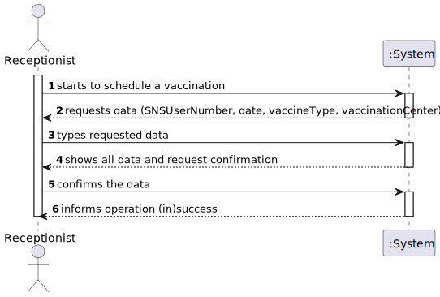
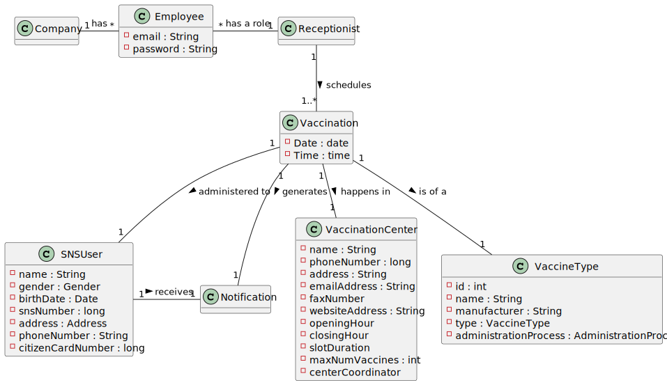
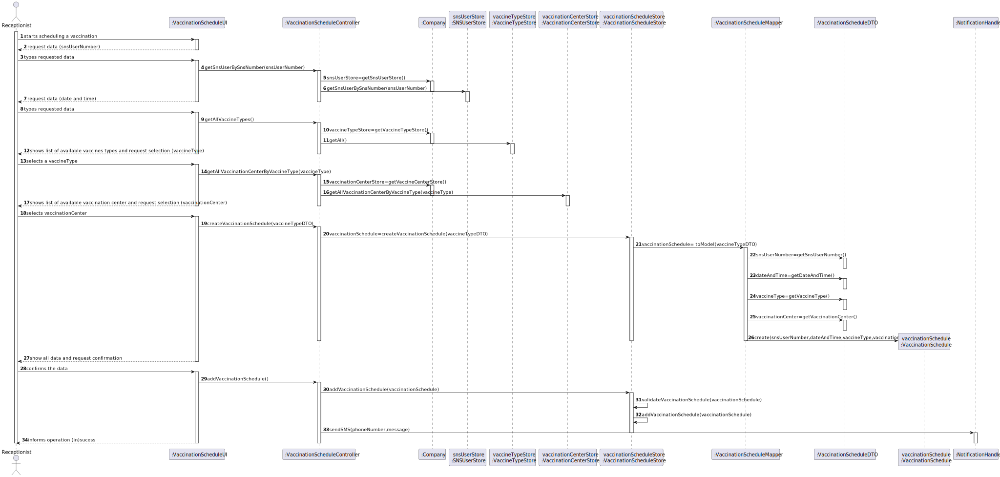
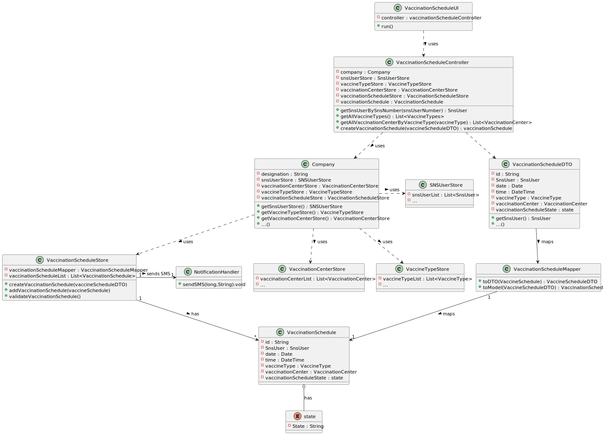

# US 02 - Schedule a Vaccination

## 1. Requirements Engineering

### 1.1. User Story Description

As a receptionist at one vaccination center, I want to schedule a vaccination.

### 1.2. Customer Specifications and Clarifications

**From the specifications document:**

> "(…)the SNS user should use the application to schedule his/her vaccination.
> The user should introduce his/her SNS user number, select the vaccination center,
> the date, and the time (s)he wants to be vaccinated as well as the type of vaccine
> to be administered (by default, the system suggests the one related to the
> ongoing outbreak)."

**From the client clarifications:**

> **Question:** I would like to ask if you could tell me if my interpretation of
> this US was correct. So my interpretation was that the receptionist should choose
> a vaccination center and than in that vaccination center she would schedule
> the second dosage of the vaccine
>
> **Answer:** The goal of this US is to schedule a vaccination for a SNS user.
> The SNS user should go to a vaccination center and a receptionist should use
> the application to schedule a vaccination for the SNS user. The receptionist
> should ask the SNS user for data required to schedule a vaccination. The data
> needed to schedule a vaccination is the same required in US01. Please check
> the Project Description available in moodle.

> **Question:** Regarding US02, i would like to know if a receptionist has the
> ability to schedule an appointment in different vaccination centres or only on
> their own.
>
> **Answer:** The receptionist has the ability to schedule the vaccine in any
> vaccination center. The receptionist should ask the SNS user to indicate/select
> the preferred vaccination center.

> **Question:** We are unsure if it's in this user stories that's asked to implement
> the "send a SMS message with information about the scheduled appointment" found
> on the Project Description available in moodle. Could you clarify?
>
> **Answer:** In a previous clarification that I made on this forum, I said:
> "[The user should receive a] SMS Message to warn of a scheduling [and the message]
> should include: Date, Time and vaccination center". Teams must record the answers!
A file named SMS.txt should be used to receive/record the SMS messages. We will not
> use a real word service to send SMSs.

> **Question:** When a receptionist schedules a vaccination for an SNS user, should
> they be presented with a list of available vaccines (brands, that meet acceptance
> criteria) from which to choose? Or should the application suggest only one?
>
> **Answer:** The receptionist do not select the vaccine brand. When the user is
> at the vaccination center to take the vaccine, the nurse selects the vaccine.
> In Sprint D we will introduce new USs where the nurse records the administration
> of a vaccine to a SNS user.

> **Question:** For the US1, the acceptance criteria is: A SNS user cannot schedule
> the same vaccine more than once. For the US2, the acceptance criteria is: The
> algorithm should check if the SNS User is within the age and time since the last vaccine.
[1] Are this acceptance criteria exclusive of each US or are implemented in both?
[2] To make the development of each US more clear, could you clarify the differences between the two US?
>
> **Answer:**
>
> 1- The acceptance criteria for US1 and US2 should be merged.
> The acceptance criteria por US1 and US2 is: A SNS user cannot schedule the same
> vaccine more than once. The algorithm should check if the SNS User is within
> the age and time since the last vaccine."
>
> 2- In US1 the actor is the SNS user, in US2 the actor is the receptionist. In
> US1 the SNS user is already logged in the system and information that is required
> and that exists in the system should be automatically obtained. In US2 the receptionist
> should ask the SNS user for the information needed to schedule a vaccination. Information
> describing the SNS user should be automatically obtained by introducing the SNS user number.

> **Clarification:**
>
> In a previous message I said: "The acceptance criteria for US1 and US2 are: a.
> A SNS user cannot schedule the same vaccine more than once. b. The algorithm
> should check if the SNS User is within the age and time since the last vaccine".
>
> We can always prepare a system for these two acceptance criteria. Even so, as
> we are in the final stage of Sprint C, we will drop the acceptance criteria b
> ( The algorithm should check if the SNS User is within the age and time since
> the last vaccine). This acceptance criteria will be included in Sprint D.

### 1.3. Acceptance Criteria

* A SNS user cannot schedule the same vaccine more than once.

### 1.4. Found out Dependencies

* There are dependencies related to the following US:
    * "US1: As a SNS user, I intend to use the application to schedule a vaccine.", because the User Interface is
      basically the same;
    * "US9: As an administrator, I want to register a vaccination center to respond to a certain pandemic.", because the
      vaccination is goint to take place in a Vaccination Center;
    * "US12: As an administrator, I intend to specify a new vaccine type.", because the vaccination is of a specific
      type of vaccine;
    * "US13: As an administrator, I intend to specify a new vaccine and its administration process.", because we need a
      vaccine technology to be defined and, afterwards, adminstred.

### 1.5 Input and Output Data

**Input Data:**

* Typed data:
    * SNS User number;
    * date and time;
* Selected data:
    * vaccine type;
    * vaccination center;

**Output Data:**

* (In)Success of the operation

### 1.6. System Sequence Diagram (SSD)

### 1.7 Other Relevant Remarks

* No other relevant trademarks.

## 2. OO Analysis

### 2.1. Relevant Domain Model Excerpt

### 2.2. Other Remarks

* No other relevant trademarks.

## 3. Design - User Story Realization

### 3.1. Rationale

| Interaction ID                                                            | Question: Which class is responsible for...   | Answer                   | Justification (with patterns)                                                                                 |
| :-------------                                                            | :---------------------                        | :------------            | :----------------------------                                                                                 |
| Step 1: starts to schedule a vaccination                                  | ... interacting with the actor?               | VaccinationScheduleUI    | Pure Fabrication: there is no reason to assign this responsibility to any existing class in the Domain Model. |
| Step 2: request data (SNSUserNumber, date, vaccineType,vaccinationCenter) | n/a                                           |                          |                                                                                                               |
|                                                                           | ... show list of available vaccine types?     | VaccineTypeStore         | IE: knows the data                                                                                            |
|                                                                           | ... show list of available vaccine center?    | VaccinationCenterStore   | IE: knows the data                                                                                            |
| Step 3: types requested data                                              | ... collecting the typed data?                | SpecifyNewVaccineUI      | Pure Fabrication: there is no reason to assign this responsibility to any existing class in the Domain Model. |
|                                                                           | ... instantiating a new Vaccination Schedule? | VaccinationScheduleStore | Creator (Rule 2) has its own constructor                                                                      |
| Step 4: shows all data and request confirmation                           | ... asking for user confirmation?             | VaccinationScheduleUI    | IE: responsible for user interaction                                                                          |
| Step 5: confirms data                                                     | ... saving the create vaccination schedule?   | VaccinationScheduleStore | IE: VaccinationScheduleStore records all VaccinationSchedule instances                                        |
|                                                                           | ... validating the vaccination schedule?      | VaccinationScheduleStore | IE: VaccinationScheduleStore has all the information related to the validation                                |
| Step 6: informs operation (in)success                                     | ... informing operation success?              | VaccinationScheduleUI    | IE: responsible for user interaction                                                                          |

### Systematization ##

According to the taken rationale, the conceptual classes promoted to software classes are:

* Company
* Vaccination Center
* Vaccination Schedule
* SNS User
* Vaccine
* Vaccine Type

Other software classes (i.e. Pure Fabrication) identified:

* VaccinationScheduleUI (Pure fabrication)
* VaccinationScheduleController (Pure fabrication)
* VaccinationScheduleStore (Pure fabrication, HC+LC)
* VaccineTypeStore  (Pure fabrication, HC+LC)
* VaccineStore (Pure fabrication, HC+LC)
* SnsUserStore (Pure fabrication, HC+LC)

## 3.2. Sequence Diagram (SD)

## 3.3. Class Diagram (CD)

# 4. Tests

* None

# 5. Construction (Implementation)

## Class CreateTaskController

* None

## Class Organization

* None

# 6. Integration and Demo

* None

# 7. Observations

* None

