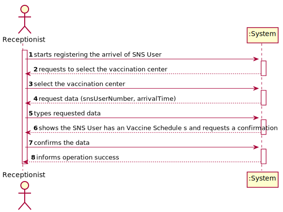
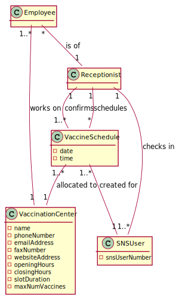
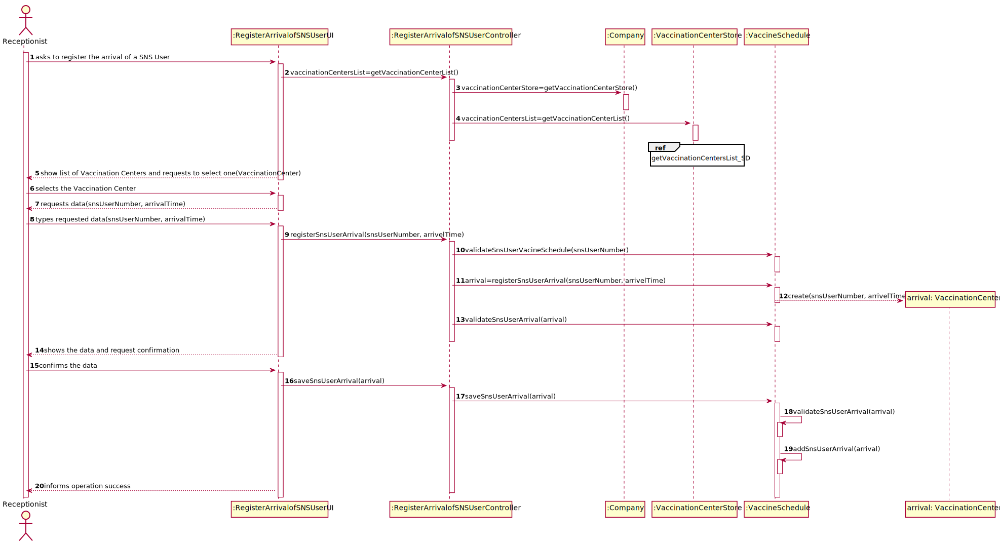
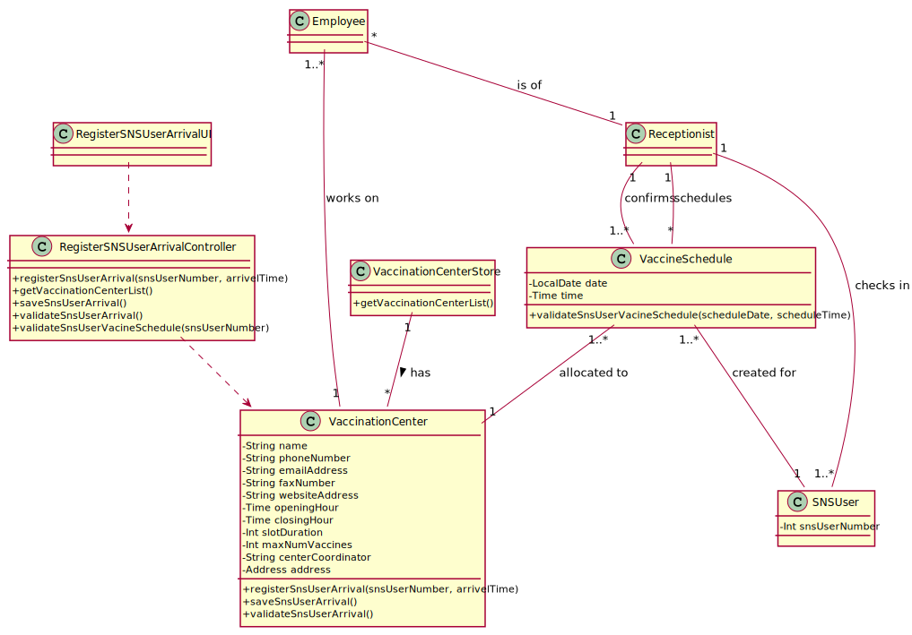

# US 04 - register the arrival of a SNS user to take the vaccine

## 1. Requirements Engineering

### 1.1. User Story Description

As a receptionist at a vaccination center, I want to register the arrival of a SNS user to take the vaccine

### 1.2. Customer Specifications and Clarifications

-  **From the specifications document:**

   -  "[...] On the scheduled day and time, the SNS user should go to the vaccination center to get the vaccine.
      When the SNS user arrives at the vaccination center, a receptionist registers the arrival of the user to
      take the respective vaccine. The receptionist asks the SNS user for his/her SNS user number and
      confirms that he/she has the vaccine scheduled for the that day and time. If the information is
      correct, the receptionist acknowledges the system that the user is ready to take the vaccine. Then,
      the receptionist should send the SNS user to a waiting room where (s)he should wait for his/her
      time [...]"

      
&nbsp;

-  **From the client clarifications:**

> **Question:** In this user story, the receptionist registers the arrival of an SNS User. Does the receptionist choose the center she works at during login like the nurse?
>
> **Answer:** To start using the application, the receptionist should first select the vaccination center where she is working. The receptionists register the arrival of a SNS user at the vaccination center where she is working.

> **Question:** The nurse must have the possibility to choose which center she wants to register the SNS user's arrival every time she uses this feature, or should we make the nurse pick a center after they log in?
>
> **Answer:** To start using the application, the nurse should first select the vaccination center where she is working.

> **Question:** When the receptionist registers a SNSUser arrival, should we validate that the vaccination center where the SNS user arrives is the same as where the receptionist is currently working? If so, should we allocate receptionists to vaccination centers, i.e., ask the receptionist which vaccination center is she currently working at?
>
> **Answer:** To start using the application, the receptionist should first select the vaccination center where she is working. The receptionists register the arrival of a SNS user at the vaccination center where she is working.

> **Question:** What are the attributes needed in order to register the arrival of a SNS user to a vaccination center?
>
> **Answer:** The time of arrival should be registered.

> **Question:** A receptionist register the arrival of a SNS user immediately when he arrives at the vaccination center or only after the receptionist confirms that the respective user has a vaccine schedule for that day and time?
>
> **Answer:** The receptionist registers the arrival of a SNS user only after confirming that the user has a vaccine scheduled for that day and time.

> **Question:** When the SNS user number is introduce by the receptionist and the system has no appointment for that SNS user number, how should the system proceed?
>
> **Answer:** The application should present a message saying that the SNS user did not scheduled a vaccination.

> **Question:** I would like to know what's the capacity of the waiting room?
>
> **Answer:** The waiting room will not be registered or defined in the system. The waiting room of each vaccination center has the capacity to receive all users who take the vaccine on given slot.

### 1.3. Acceptance Criteria

-  No duplicate entries should be possible for the same SNS user on the same day or vaccine period.

### 1.4. Found out Dependencies

-  There is a dependency to "US09 Register a vaccination center to respond to a certain pandemic" since the vaccinations centers have to be registered in the system so can be selected at the time of the registration SNS User's arrival.

-  There is a dependency to "US02 Schedule a vaccination." since the Sns user has to have a vaccination schedule prior to register his arrival at a vaccination center.

### 1.5 Input and Output Data

**Input Data:**

-  Typed data:
   -  Sns user number
   -  Sns user arrivelTime
-  Selected data:
   -  Vaccination center

**Output Data:**

-  List of vaccination centers
-  Success of the operation

### 1.6. System Sequence Diagram (SSD)

### 1.7 Other Relevant Remarks

No other relevant remarks.

## 2. OO Analysis

### 2.1. Relevant Domain Model Excerpt

### 2.2. Other Remarks

No other relevant remarks.

## 3. Design - User Story Realization

### 3.1. Rationale

| Interaction ID                                                                  | Question: Which class is responsible for...     | Answer                             | Justification (with patterns)                                                                                 |
| :------------------------------------------------------------------------------ | :---------------------------------------------- | :--------------------------------- | :------------------------------------------------------------------------------------------------------------ |
| Step 1 - starts registering the arrivel of SNS User                             | ... interacting with the actor?                 | RegisterArrivalofSNSUserUI         | Pure Fabrication: there is no reason to assign this responsibility to any existing class in the Domain Model. |
|                                                                                 | ... coordinating the US?                        | RegisterArrivalofSNSUserController | Controller.                                                                                                   |
|                                                                                 | ... register the arrivel of a new SNS User?     | VaccineSchedule                    | Creator (Rule 1): in the DM Vaccination Centers have the information about the Vaccine Schedule.              |
| Step 2 - shows a list of vaccination centers and requests to select 1           | ... getting a list of Vaccination Centers       | VaccinationCenterStore             | IE: knows all Vaccination Centers.                                                                            |
|                                                                                 | ... showing data to the user?                   | RegisterArrivalofSNSUserUI         | IE: responsible for user interactions.                                                                        |
| Step 3 - select the vaccination center                                          | ... asking for user input/option selection?     | RegisterArrivalofSNSUserUI         | IE: responsible for user interactions.                                                                        |
| Step 4 - request data (snsUserNumber)                                           | n/a                                             |                                    |                                                                                                               |
| Step 5 - types requested data                                                   | ... instantiating a new SNS User Arrival object | VaccineSchedule                    | Creator (Rule 1): in the DM Vaccination Centers have the information about the SNS User Arrival.              |
| Step 6 - shows the SNS User has an Vaccine Schedule and requests a confirmation | ... asking for user confirmation?               | RegisterArrivalofSNSUserUI         | IE: responsible for user interactions.                                                                        |
|                                                                                 | ... cheking if SNS User has a Vaccine Schedule  | VaccineSchedule                    | IE: knows all SNS User Vaccine Schedule.                                                                      |
|                                                                                 | ... cheking for SNS User Arrival duplication    | VaccineSchedule                    | IE: Knows all SNS User Arrival objects.                                                                       |
| Step 7 - confirms the data                                                      | ... saving the created SNS User Arrival         | VaccineSchedule                    | IE: records all SNS User Arrival objects.                                                                     |
| Step 8 - informs operation success                                              | ... informing operation success?                | RegisterArrivalofSNSUserUI         | IE: responsible for user interactions.                                                                        |

### Systematization

According to the taken rationale, the conceptual classes promoted to software classes are:

-  VaccineSchedule

Other software classes (i.e. Pure Fabrication) identified:

-  RegisterArrivalofSNSUserUI
-  RegisterArrivalofSNSUserController
-  VaccinationCenterStore

## 3.2. Sequence Diagram (SD)

## 3.3. Class Diagram (CD)

# 4. Tests

n/a

# 5. Construction (Implementation)

n/a

# 6. Integration and Demo

n/a

# 7. Observations

n/a
