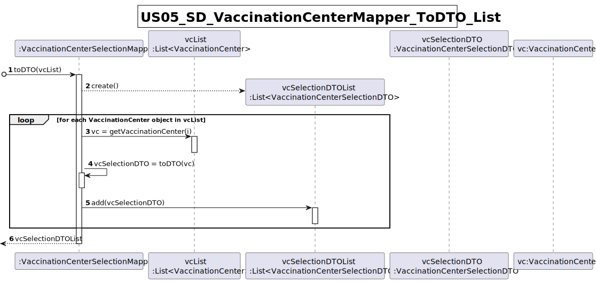
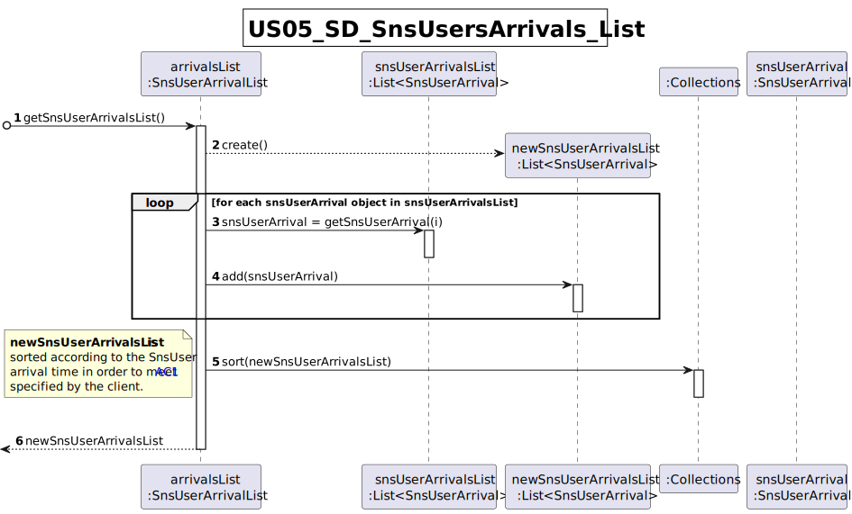

# US 05 - Consult users in waiting room of a vaccination center

## 1. Requirements Engineering
### 1.1. User Story Description

As a nurse, I intend to consult the users in the waiting room of a vacination center.

### 1.2. Customer Specifications and Clarifications 

**From the Specifications Document:**

> "At any time, a **nurse** responsible for administering the vaccine will use the application to **check the
list of SNS users that are present in the vaccination center** to take the vaccine [...]."

**From the client specifications:**

> **Question**
> 
> - In the PI description it is said that, by now, the nurses and the receptionists will work at any center. Will this information remain the same on this Sprint, or will they work at a specific center?
>
> **Answer**
>
> - Nurses and receptionists can work in any vaccination center.

> **Question**
> 
>  - What does consulting constitute in this context? Does it refer only to seeing who is present and deciding who gets the vaccine or is checking the user info to administer the vaccine, registering the process, and sending it to the recovery room also part of this US?
>
> **Answer**
> 
> - The goal is to check the list of users that are waiting and ready to take the vaccine.

> **Question**
> 
> 1 - We need to know if the nurse have to chose the vaccination center before executing the list or if that information comes from employee file?
>
> 2 - We need to know what is the name of the attribute that defines that the user has arrived. In the last sprint we have created the “Status” attribute, can we continue using it?
>
> **Answer**
> 
> 1 - When the nurse starts to use the application, firstly, the nurse should select the vaccination center where she his working. The nurse wants to check the list of SNS users that are waiting in the vaccination center where she his working.
> 
> 2 - This is not a question for the client.

> **Question**
> 
> - I would like to know which are the attributes of the waiting room.
>
> **Answer**
> 
> - The waiting room will not be registered or defined in the system. The waiting room of each vaccination center has the capacity to receive all users who take the vaccine on given slot.

> **Question**
>  - What information about the Users (name, SNS number, etc) should the system display when listing them?
> 
> **Answer**
>  - Name, Sex, Birth Date, SNS User Number and Phone Number.

> **Question**
>  - Is it supposed to remove a SNS user of the wait list when he leaves the waiting room to get the vaccine? If yes, how do we know when the sns user leaves the waiting room?
> 
> **Answer**
> - US5 is only to list users that are in the waiting room of a vaccination center. In Sprint D we will introduce new user stories.

> **Question**
>
> - Regarding US05, the listing is supposed to be for the day itself or for a specific day.
> 
> **Answer**
> - The list should show the users in the waiting room of a vaccination center.

### 1.3. Acceptance Criteria

- AC1: SNS Users’ list should be presented by order of arrival.

### 1.4. Found out Dependencies

The analysis and design of this US is dependent on the design of [US01]() and [US04]().

### 1.5 Input and Output Data

**Input Data**

* N/A;

**Output Data**
  + List of SNS users ready for taking the vaccine sorted by arrival time.

### 1.6. System Sequence Diagram (SSD)

### 1.7 Other Relevant Remarks

No other relevant remarks.

## 2. OO Analysis

### 2.1. Relevant Domain Model Excerpt 

## 3. Design - User Story Realization 

### 3.1. Rationale

**The rationale grounds on the SSD interactions and the identified input/output data.**

| Interaction ID                                                  | Question: Which class is responsible for... | Answer  | Justification (with patterns)  |
|:----------------------------------------------------------------|:--------------------- |:------------|:---------------------------- |
| Step 1: starts requesting list of SNS Users in the waiting room | ... interacting with the actor?  | ConsultUsersWaitingRoomUI | Pure Fabrication: there is no reason to assign this responsibility to any existing class in the Domain Model. |
|                                                                 | ... handling request to show the list of Users waiting?      | ConsultUsersWaitingController  | Controller |
|                                                                 | ... getting the current vaccination center?       |  VaccinationCenterStore  | IE: VaccinationCenterStore records all VaccinationCenter objects |
|                                                                 | ... managing the list of Sns Users admitted for vaccination? | SnsUserArrivalList | IE and HC+LC: SnsUserArrivalList records all checked-in Sns Users for taking the vaccine. Responsibility of managing the instances of SnsUserArrival is transferred from the VaccinationCenter to the present class, increasing cohesion and decreasing coupling. |
|                                                                 | ... encapsulating the SnsUserArrival data for transfer between the domain and the UI? | SnsUserArrivalDTO | DTO: domain objects are not directly exposed to the UI. Only relevant information is encapsulated in the DTO and exposed to the user. | 
| Step 2: shows list of SNS Users in the waiting room             | ... showing the data to the user? | ConsultUsersWaitingRoomUI | IE: responsible for interacting with the user |

### Systematization ##

According to the taken rationale, the conceptual classes promoted to software classes are: 
* SnsUserArrival
* WaitingRoom (SnsUserArrivalList)

Other software classes identified: 
 * ConsultUsersWaitingRoomUI (Pure fabrication)
 * ConsultUsersWaitingRoomController (Pure fabrication)
 * SnsUserArrivalDTO (DTO)
 * SnsUserArrivalMapper
 
## 3.2. Sequence Diagram (SD)

## 3.3. Class Diagram (CD)

# 4. Tests 
n/a

# 5. Construction (Implementation)
n/a

# 6. Integration and Demo 

n/a
# 7. Observations

n/a

