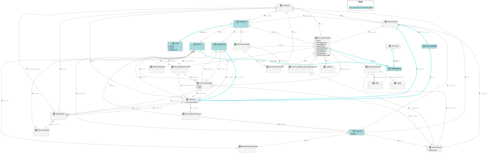

# OO Analysis

The construction process of the domain model is based on the client specifications, especially the nouns (for _
concepts_) and verbs (for _relations_) used.

## Rationale to identify domain conceptual classes

To identify domain conceptual classes, start by making a list of candidate conceptual classes inspired by the list of
categories suggested in the book "Applying UML and Patterns: An Introduction to Object-Oriented Analysis and Design and
Iterative Development".

| Category                                           | Candidate classes                                                                         |
|:---------------------------------------------------| :------------------------------------------------------------------                       |
| Business Transactions                              | Application                                                                               |
| Transaction Line Items                             | Vaccine                                                                                   |
| Product/Service related to a Transaction           | VaccineType, VaccineAdministration,                                                       |
| Transaction Records                                | VaccineSchedule,RecoveryPeriod, VaccinationProcess, AdverseReaction                       |
| Roles of People or Organizations                   | Nurse, NurseHCC, Receptionist,ReceptionistHCC, Administrator, SNSUser, CenterCoordinator, |
| Places                                             | VaccinationCenter, CommunityMassVaccinationCenter, HealthCareCenter                       |
| Noteworthy Events                                  | VaccineSchedule, VaccineAdministration, Notification                                      |
| Physical Objects                                   | Vaccine, VaccinationCertificate                                                           |
| Descriptions of Things                             | VaccineType, VaccineAdministrationInstruction                                             |
| Catalogs                                           | -                                                                                         |
| Containers                                         | -                                                                                         |
| Elements of Containers                             | -                                                                                         |
| Organizations                                      | DGS, ARS, AGES                                                                            |
| Other External/Collaborating Systems               | WHO                                                                                       |
| Records of finance, work, contracts, legal matters | Address                                                                                   |
| Financial Instruments                              | -                                                                                         |
| Documents mentioned/used to perform some work      | VaccineAdministrationInstruction                                                          |

### **Rationale to identify associations between conceptual classes**###

An association is a relationship between instances of objects that indicates a relevant connection and that is worth of
remembering, or it is derivable from the List of Common Associations:

- **_A_** is physically or logically part of **_B_**
- **_A_** is physically or logically contained in/on **_B_**
- **_A_** is a description for **_B_**
- **_A_** known/logged/recorded/reported/captured in **_B_**
- **_A_** uses or manages or owns **_B_**
- **_A_** is related with a transaction (item) of **_B_**
- etc.

| Concept (A)                    | Association                 | Concept (B)                      |
|:-------------------------------|:----------------------------|:---------------------------------|
| Company                        | has                         | VaccinationCenter                |
| Company                        | has                         | Administrator                    |
| Company                        | owns                        | SNSUSer                          |
| Company                        | has                         | Vaccine                          |
| Company                        | has                         | VaccineProcess                   |
| Company                        | sends confirmation          | Notification                     |
| Company                        | sends recovery period ended | Notification                     |
| Administrator                  | manages                     | VaccinationCenter                |
| Administrator                  | manages                     | VaccineType                      |
| Administrator                  | manages                     | Vaccine                          |
| Administrator                  | manages                     | Employee                         |
| Administrator                  | makes use of                | ExternalModule                   |
| Administrator                  | registers                   | SnsUser                          |
| ExternalModule                 | has                         | SnsUser                          |
| SNSUSer                        | requests                    | VaccinationCertificate           |
| SNSUSer                        | authorizes                  | Notification                     |
| VaccinationCenter              | has                         | CenterCoordinator                |
| VaccinationCenter              | has                         | VaccinationProcess               |
| VaccinationCenter              | has                         | Address                          |
| VaccinationCenter              | implements                  | VaccineAdministration            |
| CommunityMassVaccinationCenter | administers                 | VaccineType                      |
| HealthCareCenter               | administers                 | VaccineType                      |
| HealthCareCenter               | is associated with          | ARS                              |
| HealthCareCenter               | is associated with          | AGES                             |
| Employee                       | works on                    | VaccinationCenter                |
| Nurse                          | administers                 | Vaccine                          |
| Nurse                          | execute                     | VaccineAdministration            |
| Nurse                          | registers                   | VaccineAdministration            |
| Nurse                          | checks info of              | SNSUser                          |
| Nurse                          | checks                      | VaccineSchedule                  |
| Nurse                          | initiates                   | RecoveryPeriod                   |
| Nurse                          | records                     | AdverseReaction                  |
| Nurse                          | checks                      | VaccineAdministrationInstruction |
| **Nurse**                      | **checks**                  | **WaitingRoom**                  |
| NurseHCC                       | issues                      | VaccinationCertificate           |
| Receptionist                   | confirms                    | VaccineSchedule                  |
| Receptionist                   | acknowledges                | VaccineAdministration            |
| Receptionist                   | checks in                   | SNSUser                          |
| **Receptionist**               | **schedules**               | **VaccineSchedule**              |
| **Receptionist**               | **manages**                 | **SNSUser**                      |
| Vaccine                        | is of                       | VaccineType                      |
| VaccineType                    | has                         | VaccineAdministrationInstruction |
| VaccinationCertificate         | referes to                  | Vaccine                          |
| VaccineSchedule                | for taking                  | VaccineType                      |
| VaccineSchedule                | created for                 | SNSUser                          |
| VaccineSchedule                | allocated to                | VaccinationCenter                |
| VaccineSchedule                | generate                    | Notification                     |
| VaccineAdministration          | fulfilling                  | VaccineSchedule                  |
| VaccineAdministration          | administered on             | SNSUSer                          |
| CenterCoordinator              | monitors                    | VaccinationProcess               |
| CenterCoordinator              | manage                      | VaccinationProcess               |
| RecoveryPeriod                 | generate                    | Notification                     |

## Domain Model

**Do NOT forget to identify concepts atributes too.**

**Insert below the Domain Model Diagram in a SVG format**

Note:  the cyan color text refers to Sprint B

Note:  the green color text refers to Sprint B

