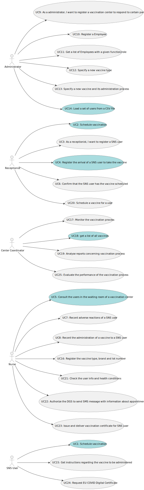

# Use Case Diagram (UCD)

**In the scope of this project, there is a direct relationship of _1 to 1_ between Use Cases (UC) and User Stories (US).**

However, be aware, this is a pedagogical simplification. On further projects and curricular units might also exist \_1 to N **and/or** N to 1 relationships between US and UC.

**For each UC/US, it must be provided evidences of applying main activities of the software development process (requirements, analysis, design, tests and code). Gather those evidences on a separate file for each UC/US and set up a link as suggested below.**

# Use Cases / User Stories

| UC/US | Description                                                                                                                                    |
| :---- |:-----------------------------------------------------------------------------------------------------------------------------------------------|
| US 1  | [As a SNS user, I intend to use the application to schedule a vaccine.](../US/US01/US01_VaccinationSchedule.md)                                |
| US 2  | [As a receptionist at one vaccination center, I want to schedule a vaccination.](../US/US02/US02_ScheduleVaccination.md)                       |
| US 3  | [As a receptionist, I want to register a SNS user.](../US/US03/US03_RegisterSnsUser.md)                                                        |
| US 4  | [As a receptionist, I want to register the arrival of a SNS user to take the vaccine.](../US/US04/US04_20RegisterSNSUserArrival.md)            |
| US 5  | [As a nurse, I intend to consult the users in the waiting room of a vacination center.](../US/US05/US05_ConsultUsersWaitingRoom.md)            |
| US 6  | [As a receptionist, I want to confirm that the SNS user has the vaccine scheduled.](US006.md)                                                  |
| US 7  | [As a nurse, I intend to record adverse reactions of a SNS user.](US007.md)                                                                    |
| US 8  | [As a nurse, I want to record the administration of a vaccine to a SNS user.](US008.md)                                                        |
| US 9  | [As a administrator, I want to register a vaccination center to respond to certain pandemic](../US/US09/US09_RegisterVaccinationCenter.md)     |
| US 10 | [As a administrator, I want to register a Employee](../US/US10/US010_RegisterEmployee.md)                                                      |
| US 11 | [As a administrator, I want to get a list of Employees with a given function/role](../US/US11/US011.md)                                        |
| US 12 | [As a administrator, I intent to specify a new vaccine type](US12.md)                                                                          |
| US 13 | [As a administrator, I intent to specify a new vaccine and its administration process](../US/US13/US013_NewVaccineAndAdministrationProcess.md) |
| US 14 | [As an administrator, I want to load a set of users from a CSV file.](../US/US014/LoadCsvFile.md)                                              |
| US 15 | [As a nurse, I want to get instructions regarding the vaccine to be administered.](US015.md)                                                   |
| US 16 | [As a nurse, I want to register the vaccine type, brand and lot number.](US016.md)                                                             |
| US 17 | [As a center coordinator, I want to monitor the vaccination process.](US017.md)                                                                |
| US 18 | [As a center coordinator, I want to get a list of all vaccines.](US018.md)                                                                     |
| US 19 | [As a center coordinator, I want to analyse reports concerning vaccination process.](US019.md)                                                 |
| US 20 | [As a receptionist, I want to schedule a vaccine for a SNS user.](US020.md)                                                                    |
| US 21 | [As a nurse, I want to check the info and health conditions of a SNS user.](US021.md)                                                          |
| US 22 | [As a SNS User, I want to authorize the DGS to send SMS message with information about appointment.](US022.md)                                 |
| US 23 | [As a nurse, I want to issue and deliver vaccination certificate for a SNS user.](US023.md)                                                    |
| US 24 | [As a SNS user, I want to request the issuance of the EU COVID Digital Certificate.](us024.md)                                                 |
| US 25 | [As a center coordinator, I want to evaluate the performance of the vaccination process.](US025.md)                                            |
