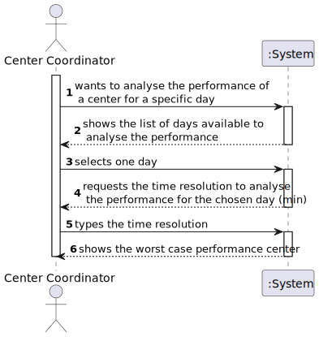

# US 016 - Analyse performance of a center

## 1. Requirements Engineering
### 1.1. User Story Description

As a center coordinator, I intend to analyze the performance of a center.

### 1.2. Customer Specifications and Clarifications 

- **From the Specifications Document:**

>    - “[...] Each vaccination center has a Center Coordinator that has the responsibility to manage the Covid-19
       vaccination process.  [...]”

>    - “[...] The goal of the performance analysis is to decrease the
       number of clients in the center, from the moment they register at the arrival, until the moment they receive
       the SMS informing they can leave the vaccination center [...]”

>    - “[...]  the application should implement a brute-force algorithm [...]”

>    - “[...]  The implemented algorithm should be analyzed in terms of its worst-case time complexity,
       and it should be compared to a benchmark algorithm provided [...]”

>    - “[...]  The computational complexity analysis , must be accompanied by the observation of the execution time of the algorithms for inputs of variable size [...]”

- **From the client specifications:**

>  - Question: should this list strictly data from thelegacy system (csv file from moodle which is loaded in US17), or should it also include data from our system?
>
>    - Answer: US 16 is for all the data that exists in the system.
  
>  - Question: I would like to know if we could strict the user to pick only those intervals (m) (i.e. 1, 5, 10, 20, 30) as options for analyzing the performance of a center, since picking intervals is dependent on the list which is 720/m (which the length is an integer result). If we let the user pick an interval that results in a non-integer result, this will result in an invalid list since some data for the performance analysis will be lost. Can you provide a clarification on this situation? ".
>
>    - Answer: The user can introduce any interval value. The system should validate the interval value introduced by the user. 
  
>  - Question: I would like to ask that if to analyse the performance of a center, we can assume (as a pre requirement) that the center coordinator was already attributed to a specific vaccination center and proceed with the US as so (like the center coordinator does not have to choose at a certain point where he is working. This is already treated before this US happens)
     >  
>    - Answer: A center coordinator can only coordinate one vaccination center. The center coordinator can only analyze the performance of the center that he coordinates.

>  - Question: In US 16, should the coordinator have the option to choose which algorithm to run (e.g. via a configuration file or while running the application) in order to determine the goal sublist, or is the Benchmark Algorithm strictly for drawing comparisons with the Bruteforce one?

>    - Answer: The algorithm to run should be defined in a configuration file.

>  - Question: The file loaded in US17 have only one day to analyse or it could have more than one day(?) and in US16 we need to select the day to analyse from 8:00 to 20:00

>    - Answer:The file can have data from more than one day. In US16 the center coordinator should select the day for which he wants to analyse the performance of the vaccination center.

### 1.3. Acceptance Criteria

- No acceptance criteria in this US.

### 1.4. Found out Dependencies

- Dependencies with US-4, US-8, US-9

### 1.5 Input and Output Data

**Input Data**

- Selected option : Day to analyse the performance center
- Time resolution for the performance analysis (in min)

**Output Data**

- Shows the worst time case performance of the center

### 1.6. System Sequence Diagram (SSD)

### 1.7 Other Relevant Remarks

According with the description of the US, the business context on the \n document specifications and the client clarifications, \n it is assumed that for this user story the center coordinator is already assigned to a vaccination center. All the formulation is done accordingly with a specific vaccination center.

## 2. OO Analysis

### 2.1. Relevant Domain Model Excerpt 
*In this section, it is suggested to present an excerpt of the domain model that is seen as relevant to fulfill this requirement.* 

### 2.2. Other Remarks

*Use this section to capture some aditional notes/remarks that must be taken into consideration into the design activity. In some case, it might be usefull to add other analysis artifacts (e.g. activity or state diagrams).* 

## 3. Design - User Story Realization 

### 3.1. Rationale

**The rationale grounds on the SSD interactions and the identified input/output data.**

| Interaction ID                                                                               | Question: Which class is responsible for...                                                              | Answer                                               | Justification (with patterns)                                                                                       |
|:---------------------------------------------------------------------------------------------|:---------------------------------------------------------------------------------------------------------|:-----------------------------------------------------|:--------------------------------------------------------------------------------------------------------------------|
| Step 1 : wants to analyze the performance of a center for a specific day 		                  | 	Interacting with the actor?						                                                                       | CenterPerformanceUI                                  | **Pure Fabrication**: there is no reason to assign this responsibility to any existing class in the Domain Model    |
| 		                                                                                           | 	obtaining the list of days available for performance?					                                              | SnsUserArrivalStore                                  | **IE + HC and LC**: has the information to retrieve the days based on the date arrivals of the users.               |
| Step 2 : shows list of days available to see the performance	                                | 	showing the data of available days for performance?						                                               | CenterPerformanceUI                                  | **IE**: responsible for user interaction.                                                                           |
| Step 3 : selects	one day                                                                     | 	receive the day option selected by the user in the UI?				                                              | CenterPerformanceController                          | **Controller**: Acts an intermediary between the UI and the domain.                                                 |
|                                                                                              | 	obtaining the working period for the chosen day?				                                                    | VaccinationCenter                                    | **IE**: knows the opening and closing hours of a vaccination center.                                                |
| Step 4 : requests the time resolution to analyse the performance \n for the chosen day (min) | 	requesting the time resolution input?					                                                              | CenterPerformanceUI                                  | **IE**: responsible for user interaction.                                                                           |
| Step 5 : types the time resolution	                                                          | 	receive the inputed time resolution from the UI? 				                                                   | CenterPerformanceController                          | **Controller**: Acts an intermediary between the UI and the domain.                                                 |
| 	                                                                                            | 	obtain list of arrivals ?				                                                                           | SnsUserArrivalStore                                  | **IE + HC and LC**: has the information of the date arrivals of the users.                                          |
|                                                                                              | 	obtain list of leavings	?				                                                                           | VaccineAdministrationStore                           | **IE + HC and LC**: has the information of the date leavings of the users.                                          |
|                                                                                              | 	Accessing to the calculation of the performance based on arrivals, leavings, day and time resoltion				 | CenterPerformanceCalculation                         | **interface**: Establish the connection of the domain model and the adpapter.                                       |
|                                                                                              | 	Calculation of the performance based on arrivals, leavings, day and time resoltion				                  | BruteForceAlgorithmAdapter BenchmarkAlgorithmAdapter | **Adapter** : Each adapter is responsible for converting requests made in accordance with our system specification. |
| Step 6 : shows the worst case performance canter		                                           | 	showing the information?						                                                                          | CenterPerformanceUI                                  | **IE**: responsible for user interaction                                                                            |

### Systematization ##

According to the taken rationale, the conceptual classes promoted to software classes are: 

 * Company
 * VaccinationCenter
 * SnsUserArrival
 * VaccineAdministration

Other software classes (i.e. Pure Fabrication, Interface) identified: 

 * CenterPerformanceUI
 * CenterPerformanceController
 * SnsUserArrivalStore
 * VaccineAdministrationStore
 * CenterPerformanceCalculation

Other software classes of external systems/components already implemented:

* BnechmarkAlgorithmAdapter
* BruteForceAlgorithmAdapter
* Preprocessing Performance

## 3.2. Sequence Diagram (SD)

General Sequence Diagram

Some details of Sequence Diagram

.svg)

## 3.3. Class Diagram (CD)

