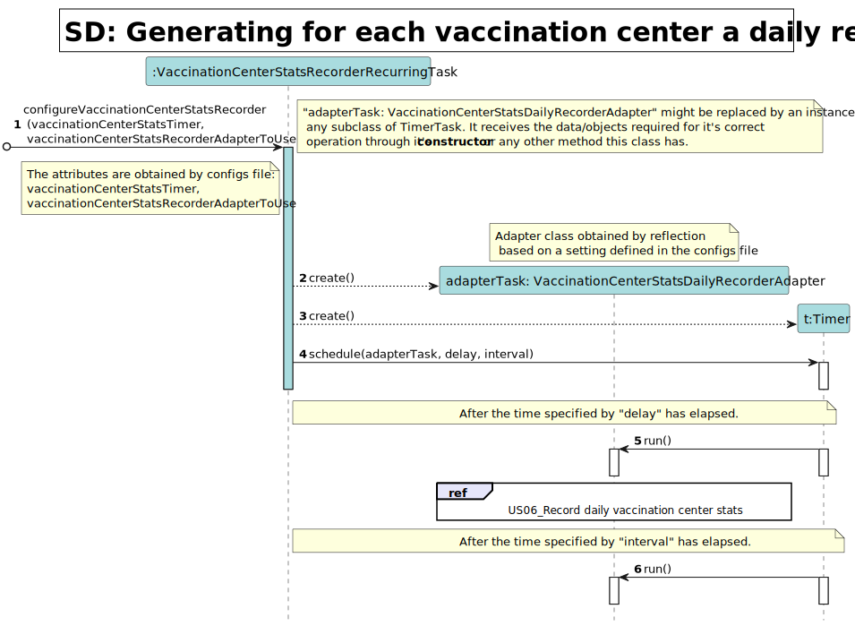

# US 06 - Generate for each vaccination center a daily report

## 1. Requirements Engineering

### 1.1. User Story Description

DGD wants to record daily the total number of people vaccinated in each vaccination center.

### 1.2. Customer Specifications and Clarifications

**From the client clarifications:**

> **1. Question:**
>   - [1] *Should we implement some sort of message for when the file is saved or warning if there were any errors saving the file using JavaFX or use JavaFX in any other away in US06?*
>   - [2] *Also, should the time be edited directly in the configuration file or should we have a way for an administrator or some other employee to change it?*
>
> 
>   - **Answer:**
>     - *1- No. The user story runs automatically without user interaction.*

>     - *2- The algorithm should run automatically at a time defined in a configuration file and should register the date, the name of the vaccination center and the total number of vaccinated users.*

> **2. Question:**
>   - [1] *(...)you said that we can either access directly the "vaccinations report" file or create the option for center coordinators and administrators to view it's content, is this correct?*
>
> 
>   - **Answer:**
>     - *1- The file should be available in the file system and anyone having access to the file system can read the file contents.*

> **3. Question:**
>   - [1] *Should the Company choose first the vaccination center that wants to analyze or should the program show the information of all the vaccination centers?*
>
>
>   - **Answer:**
>     - *The application should show the information for all vaccination centers.*

> **4. Question:**
>   - [1] *We would like to know which kind of user (Administrator, Nurse...) is supposed to have access to the file generated by the system.*
>   - [2] *Also, is it supposed to have the possibility to change the information on the configuration file? If so, who can do it?*
>
>
>   - **Answer:**
>     - *1- Someone from DGS.*

>     - *2- Yes. Please discuss this question with ESOFT teachers.*

> **5. Question:**
>   - [1] *As per the acceptance criteria, can the job be deployed manualy by a specific actor like Receptionist, Administrator,...? Who does the initial configuration for the automatic job?*
>
>
>   - **Answer:**
>     - *The algorithm should run automatically at a time defined in a configuration file and should register the date, the name of the vaccination center and the total number of vaccinated users.*

> **6. Question:**
>   - [1] *Regarding this answer we group 62 would like to know if the user should insert a certain path were the civ file is saved to.*
>
>
>   - **Answer:**
>     - *Please discuss this issue with ESOFT teachers.*

### 1.3. Acceptance Criteria

**AC01:** Acceptance criteria: The algorithm should run automatically at a time in a configuration file and should register the date,
the name of the vaccination center and the total number of vaccinated users. 

### 1.4. Found out Dependencies

- The existence of the SNS User depends on the success of **US3: As a receptionist, I want to register a SNS user**
- The existence of the Vaccination Centers list depends on the success of **US9: As an administrator, I want to register a vaccination center to respond to a certain
  pandemic.**
- The existence of the vaccination schedules list depends on the success of **US1: As a Sns User, I intend to use the application to schedule a vaccine**
- The existence of the vaccination schedules list depends on the success of **US2: As a receptionist at one vaccination center, I want to schedule a vaccination**

### 1.5 Input and Output Data

*Identity here the data to be inputted by the system actor as well as the output data that the system have/needs to
present in order to properly support the actor actions. Regarding the inputted data, it is suggested to distinguish
between typed data and selected data (e.g. from a list)*

|             | Description    | Comments                                                                                                                |
|:------------|:---------------|:------------------------------------------------------------------------------------------------------------------------|
| Input Data  | N/A            | Is a automatic scheduled task                                                                                           |
| Output Data | N/A            | A daily report is generated with the date, the name of the vaccination center and the total number of vaccinated users. |

### 1.6. System Sequence Diagram (SSD)

### 1.7 Other Relevant Remarks

> - Nothing to declare

## 2. OO Analysis

### 2.1. Relevant Domain Model Excerpt

### 2.2. Other Remarks

> - Nothing to declare

## 3. Design - User Story Realization

### 3.1. Rationale

**The rationale grounds on the SSD interactions and the identified input/output data.**

| Interaction ID                                 | Question: Which class is responsible for...                               | Answer                                      | Justification (with patterns)                                                                                                                                                                                                                            |
|:-----------------------------------------------|:--------------------------------------------------------------------------|:--------------------------------------------|:---------------------------------------------------------------------------------------------------------------------------------------------------------------------------------------------------------------------------------------------------------|
| Step 1: Schedule task: generate a daily report | ... creates the configuration scheduled task class?                       | Company                                     | **IE**: Company knows which scheduler task need to be initialized                                                                                                                                                                                        |
|                                                | ... knowing which task needs to be triggered?                             | VaccinationCenterStatsRecorderRecurringTask | **HC+LC** and **Pure Fabrication:** The Company knows what is the necessary task to trigger. But, by applying HC + LC and pure fabrication pattern to the Company, this delegates that responsibility to the VaccinationCenterStatsRecorderRecurringTask | 
|                                                | ... getting the necessary config files for the task?                      | VaccinationCenterStatsRecorderRecurringTask | **IE**: Knows about all the configuration files.                                                                                                                                                                                                         |
|                                                | ... getting the list of vaccination centers?                              | VaccinationCenterStore                      | **IE**: Knows all vaccination centers and has access to the information of their attributes. The VaccinationCenterStore exists by application of **HC + LC** pattern to the Company.                                                                     |
|                                                | ... getting the list of vaccination schedules?                            | VaccinationScheduleStore                    | **IE**: Knows all vaccination schedule and has access to the information of their attributes. The VaccinationScheduleStore exists by application of **HC + LC** pattern to the Company.                                                                  |
|                                                | ... getting the daily number of vaccinations for each vaccination center? | VaccinationCenterStatsDailyRecorderAdapter  | **IE** and **Pure Fabrication**                                                                                                                                                                                                                          |
|                                                | ... knowing what information needs to be registered in the report?        | VaccinationCenterStatsDailyRecorderAdapter  | **Polymorphism**: Assigning responsibilities in order to create a stable behavior for generating stats reports.                                                                                                                                          |
|                                                | ... generating the report with all the requested information?             | VaccinationCenterStatsDailyRecorderAdapter  | **IE** and **Pure Fabrication**: Knows format and creates the report.                                                                                                                                                                                    | 
|                                                | ... registering the event status in a log file?                           | VaccinationCenterStatsDailyRecorderAdapter  | **IE** and **Pure Fabrication**: There is no reason to assign this responsibility to any existing class in the Domain Model.                                                                                                                             |

### Systematization ##

According to the taken rationale, the conceptual classes promoted to software classes are:

* TaskScheduler (implemented as VaccinationCenterStatsRecorderRecurringTask)

Other software classes (i.e. Pure Fabrication) identified:

* VaccinationCenterStatsDailyRecorderAdapter

## 3.2. Sequence Diagram (SD)

## 3.3. Class Diagram (CD)

# 4. Tests

**Omitted** Outside the scope of ESOFT;

# 5. Construction (Implementation)

**Omitted** Outside the scope of ESOFT;

# 6. Integration and Demo

- The US6 runs automatically without user interaction, so navigation menu is not required;

# 7. Observations

> - Nothing to declare

