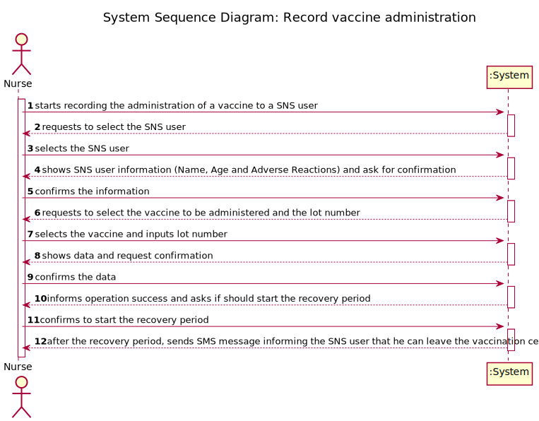
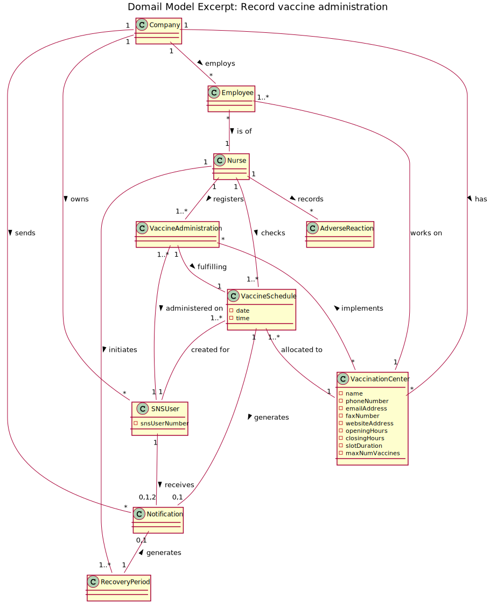
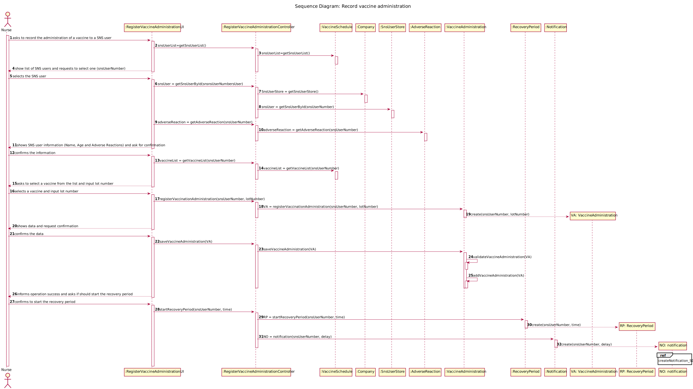
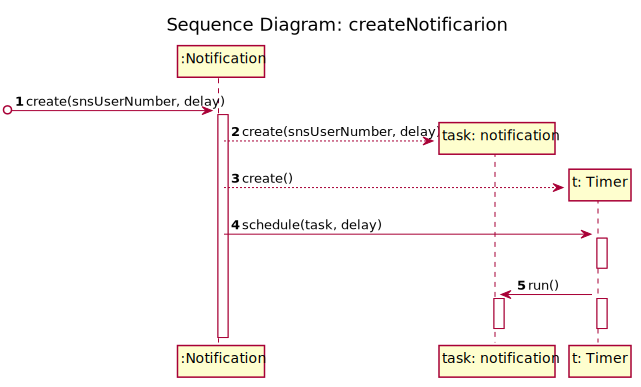
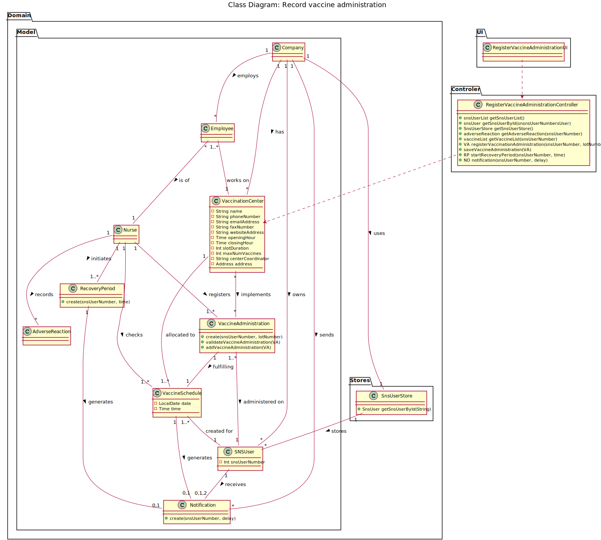

# US 08 - record the administration of a vaccine to a SNS user.

## 1. Requirements Engineering

### 1.1. User Story Description

AS a nurse, I want to record the administration of a vaccine to a SNS user. At the end of the recovery period, the user should receive a SMS message informing the SNS user that he can leave the vaccination center.

### 1.2. Customer Specifications and Clarifications

-  **From the specifications document:**

   -  "[...] a nurse responsible for administering the vaccine will use the application to check the list of SNS users that are present in the vaccination center to take the vaccine and will call one SNS user to administer him/her the vaccine [...]"
      "[...] The nurse checks the user info and health conditions in the system and in accordance with the scheduled vaccine type, and the SNS user vaccination history, (s)he gets system instructions regarding the vaccine to be administered (e.g.: vaccine and respective dosage considering the SNS user age group). After giving the vaccine to the user, each nurse registers the event in the system, more precisely, registers the vaccine type (e.g.: Covid-19), vaccine name/brand (e.g.: Astra Zeneca, Moderna, Pfizer), and the lot number used. Afterwards, the nurse sends the user to a recovery room, to stay there for a given recovery period (e.g.: 30 minutes). If there are no problems, after the given recovery period, the user should leave the vaccination center.[...]"

 
&nbsp;

-  **From the client clarifications:**

> **Question:** To access the user info - scheduled vaccine type and vaccination history -, should the nurse enter user's SNS number?
>
> **Answer:** The nurse should select a SNS user from a list of users that are in the center to take the vaccine.

> **Question:** Supposing that the SNS user has already received a dose of a given vaccine type (for example, COVID-19), the user can only receive the same vaccine or a different one with the same vaccine type?
>
> **Answer:** The SNS user can only receive the same vaccine.
> Related information:
> A SNS user is fully vaccinated when he receives all doses of a given vaccine.
> A SNS user that has received a single-dose vaccine is considered fully vaccinated and will not take more doses.
> A SNS user that is fully vaccinated will not be able to schedule a new vaccine of the type for which he is already fully vaccinated.

> **Question:** 1: The system displays the list of possible vaccines to be administered (considering the age group of the user); then the nurse selects the dose she is going to administer and gets information about the dosage. But wouldn't it be more correct, since the system knows the vaccination history, in other words, if the user has already take x dose(s) of that vaccine, to simply show the dose and the respective dosage and not ask for the nurse to arbitrarily select it?
> 2: After giving the vaccine to the user, how should the nurse register the vaccine type? by the code?
>
> **Answer:** 1- If it is the first dose, the application should show the list of possible vaccines to be administered. If is is not a single dose vaccine, when the SNS user arrives to take the vaccine, the system should simply show the dose and the respective dosage.
> 2- A vaccine is associated with a given vaccine type. Therefore, there is no need to register the vaccine type.
> Moreover, the nurse should also register the vaccine lot number (the lot number has five alphanumeric characters an hyphen and two numerical characters (example: 21C16-05)).

> **Question:** As we can read in Project Description, the vaccination flow follows these steps:
>
> 1. Nurse calls one user that is waiting in the waiting room to be vaccinated;
> 2. Nurse checks the user's health data as well as which vaccine to administer;
> 3. Nurse administers the vaccine and registers its information in the system.
>    The doubt is: do you want US08 to cover steps 2 and 3, or just step 3?
>
> **Answer:** 1. The nurse selects a SNS user from a list; 2. Checks user's Name, Age and Adverse Reactions registered in the system. 3. Registers information about the administered vaccine.

> **Question:** Regarding the recovery period, how should we define it? Is it the same for all vaccines or should the nurse specify in each case what the recovery time is?
>
> **Answer:** The recovery period/time is the same for all vaccines. The recovery period/time should be defined in a configuration file.

> **Question:** 1: Is the nurse responsible for registering in the system the recovery period? 2: If there are no adverse reactions detected/registered, after the given recovery period, the system notifies the user that his/her recovery period has ended, right? 3: If there are adverse reactions detected/registered, the system should not do anything additional?
>
> **Answer:** 1- No. The recovery period starts automatically after registering the administration of a given vaccine.
> 2 and 3- US7 and US 8 are independent user stories.

### 1.3. Acceptance Criteria

-  The nurse should select a vaccine and the administered dose number.

### 1.4. Found out Dependencies

-

### 1.5 Input and Output Data

**Input Data:**

-  Typed data:

   -  Vaccine lot number

-  Selected data:
   -  SNS user number
   -  Vaccine

**Output Data:**

-  SMS message to the SNS user
-  Success of the operation

### 1.6. System Sequence Diagram (SSD)

### 1.7 Other Relevant Remarks

No other relevant remarks.

## 2. OO Analysis

### 2.1. Relevant Domain Model Excerpt

### 2.2. Other Remarks

No other relevant remarks.

## 3. Design - User Story Realization

### 3.1. Rationale

| Interaction ID                                                                                                         | Question: Which class is responsible for...                        | Answer                                  | Justification (with patterns)                                                                                   |
| :--------------------------------------------------------------------------------------------------------------------- | :----------------------------------------------------------------- | :-------------------------------------- | :-------------------------------------------------------------------------------------------------------------- |
| Step 1 - starts recording the administration of a vaccine to a SNS user                                                | ... interacting with the actor?                                    | RegisterVaccineAdministrationUI         | Pure Fabrication: there is no reason to assign this responsibility to any existing class in the Domain Model.   |
|                                                                                                                        | ... coordinating the US?                                           | RegisterVaccineAdministrationController | Controller.                                                                                                     |
|                                                                                                                        | ... register the administration of the vaccine?                    | VaccineAdministration                   | Creator (Rule 1): in the DM VaccineAdministration has the information about the administration of the vaccines. |
| Step 2 - requests to select the SNS user                                                                               | ... getting a list of SNS Users that are in the vaccination center | VaccineSchedule                         | IE: knows all the SNS Users that are in the Vaccination center to take a vaccine                                |
|                                                                                                                        | ... showing data to the user?                                      | RegisterVaccineAdministrationUI         | IE: responsible for user interactions.                                                                          |
| Step 3 - selects the SNS user                                                                                          | ... asking for user input/option selection?                        | RegisterVaccineAdministrationUI         | IE: responsible for user interactions.                                                                          |
| Step 4 - shows SNS user information (Name, Age and Adverse Reactions) and ask for confirmation                         | ... getting the SNS User information                               | SNSUserStore                            | IE: knows all the SNS Users information.                                                                        |
|                                                                                                                        | ... getting the SNS User information                               | SNSUserStore                            | Pure Fabrication: applying HC + LC pattern to the Company                                                       |
|                                                                                                                        | ... getting the SNS User adverse reactions                         | Adverse reactions                       | IE: knows the adverse reaction of the SNS User.                                                                 |
|                                                                                                                        | ... showing data to the user?                                      | RegisterVaccineAdministrationUI         | IE: responsible for user interactions.                                                                          |
| Step 5 - confirms the information                                                                                      | ... asking for user confirmation?                                  | RegisterVaccineAdministrationUI         | IE: responsible for user interactions.                                                                          |
| Step 6 - requests to select the vaccine to be administered and the lot number                                          | ... getting a list of vaccines to be administered                  | VaccineSchedule                         | IE: knows the vaccine that the SNS user is taking                                                               |
|                                                                                                                        | ... showing data to the user?                                      | RegisterVaccineAdministrationUI         | IE: responsible for user interactions.                                                                          |
| Step 7 - selects the vaccine and inputs lot number                                                                     | ... asking for user input/option selection?                        | RegisterVaccineAdministrationUI         | IE: responsible for user interactions.                                                                          |
|                                                                                                                        | ... instantiating a new VaccineAdministration object               | VaccineAdministration                   | Creator (Rule 1): in the DM VaccineAdministration has the information about the administration of the vaccines. |
| Step 8 - shows data and request confirmation                                                                           | ... asking for user confirmation?                                  | RegisterVaccineAdministrationUI         | IE: responsible for user interactions.                                                                          |
|                                                                                                                        | ... cheking if SNS User has already taken that vaccine             | VaccineAdministration                   | IE: knows all VaccineAdministration objects.                                                                    |
| Step 9 - confirms the data                                                                                             | ... saving the created SNS User Arrival                            | VaccineAdministration                   | IE: records all VaccineAdministration objects.                                                                  |
| Step 10 - informs operation success and asks if should start the recovery period                                       | ... informing operation success?                                   | RegisterVaccineAdministrationUI         | IE: responsible for user interactions.                                                                          |
| Step 11 - confirms to start the recovery period                                                                        | ... instantiating a new VaccineAdministration object               | Recovery period                         | Creator (Rule 1): in the DM RecoveryPeriod has the information about the recovery period.                       |
|                                                                                                                        | ... cheking if SNS User has already a recovery period ongoing      | Recovery period                         | IE: knows all RecoveryPeriod objects.                                                                           |
|                                                                                                                        | ... saving the created SNS User Recovery Period                    | Recovery period                         | IE: records all RecoveryPeriod objects.                                                                         |
| Step 12 - after the recovery period, sends SMS message informing the SNS user that he can leave the vaccination center | ... sending SMS message to SNS User                                | Notification                            | Creator (Rule 1): in the DM Notification has the information about the SMS messagens sent to SNS Users.         |

### Systematization

According to the taken rationale, the conceptual classes promoted to software classes are:

-  VaccineAdministration
-  VaccineSchedule
-  RecoveryPeriod
-  Notification

Other software classes (i.e. Pure Fabrication) identified:

-  RegisterVaccineAdministrationUI
-  RegisterVaccineAdministrationController
-  SNSUserStore

## 3.2. Sequence Diagram (SD)

## 3.3. Class Diagram (CD)

# 4. Tests

n/a

# 5. Construction (Implementation)

n/a

# 6. Integration and Demo

n/a

# 7. Observations

n/a
