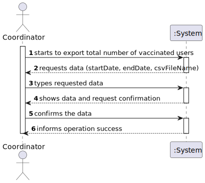
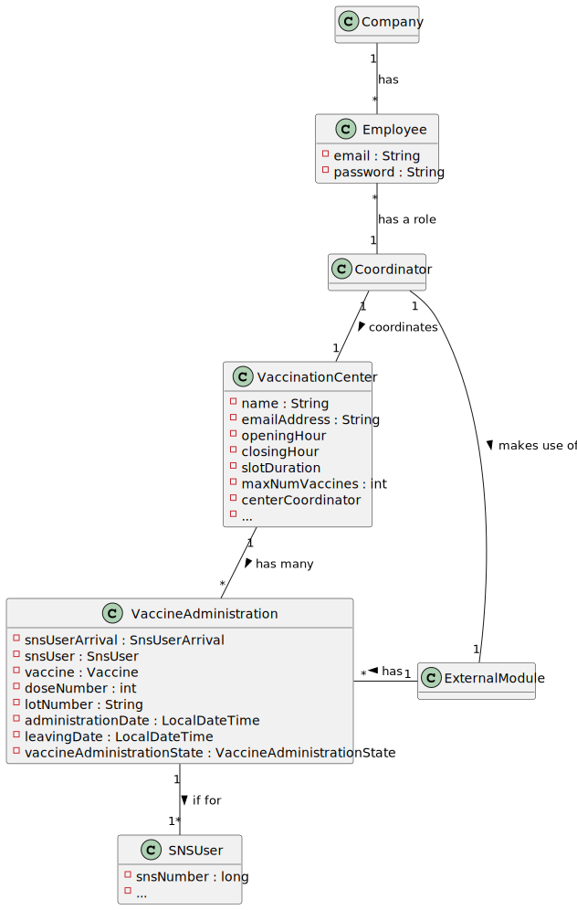
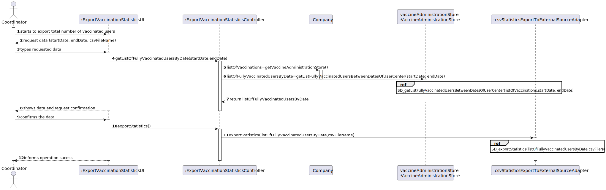
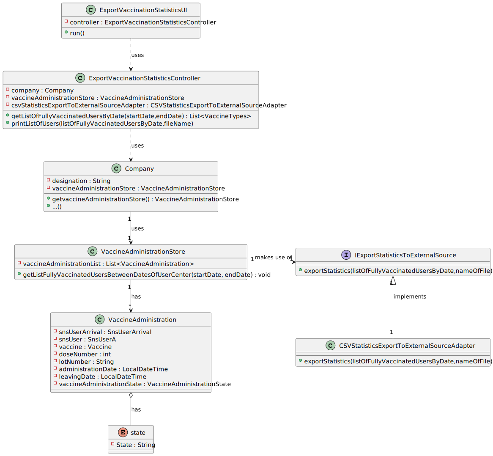

# US 15 - Export Vaccination Statistics

## 1. Requirements Engineering

### 1.1. User Story Description

As a center coordinator, I intend to check and export vaccination statistics. I want to export, to a csv file, the total
number of fully vaccinated users per day.

### 1.2. Customer Specifications and Clarifications

**From the specifications document:**

> "(...)Each vaccination center has a Center Coordinator that has the responsibility to manage the Covid- 19 vaccination process. The Center Coordinator wants to monitor the vaccination process, to see statistics and charts, to evaluate the performance of the vaccination process, generate reports and analyze data from other centers, including data from law systems. The goal of the performance analysis is to decrease the number of clients in the center, from the moment they register at the arrival, until the moment they receive the SMS informing they can leave the vaccination center. To evaluate this, it proceeds as follows: for any time interval on one day, the difference between the number of new clients arrival and the number of clients leaving the center every five-minute period is computed. In the case of a working day, with a center open from 8 a.m. until 8 p.m., a list with 144 integers is obtained, where a positive integer means that in such a five-minute slot more clients arrive at the center for vaccination than clients leave with the vaccination process completed. A negative integer means the opposite.(...)"

**From the client clarifications:**

> **Question:**
> 1-When exporting vaccination statistics,do we export the data from
> all days available in the system or does the center coordinator chooses the time interval?
>
>2-Is there any kind of format our exported data should follow?
>
> **Answer:**
> 1-The user should define a time interval (two dates).
>
> 2-Data format: date; number of fully vaccinated user.

> **Question:** Is the exportation of the CSV file that contains the total number
> of fully vaccinated users per day, the only feature that needs to be implemented
> in code, for US15?
>
> **Answer:** Yes.

> **Question:**
> 1-Should the user introduce the name of the file intended to export
> the vaccination statistics?
>
> 2-Are the vaccination statistics refering only to the fully vaccinated users or
> refering to something more?
>
> **Answer:**
> 1-The user should introduce the name of the file.
>
> 2-Only to fully vaccinated users.

> **Question:** In this US should the Center Coordinator check and export the
> Vaccination Statistics of the Center where he/she works at or should just
> check and export the Vaccination Statistics of all centers?
>
> **Answer:** The center coordinator can only export statistics from the vaccination
> center that he coordinates.

> **Question:** I want to know what you mean about fully vaccinated, it is a person
> who have take all the doses that are defined for a specific vaccine?
>
> **Answer:** I already answered this question, please pay more attention to client 
> answers. Again, a SNS user is fully vaccinated when he receives all doses of a 
> given vaccine. A SNS user that has received a single-dose vaccine is considered 
> fully vaccinated and will not take more doses. 

> **Question:** In US 15, we only need to used Anova for calculate the values or 
> we need to put the formulas for do the same calculations that Anova do?
>
> **Answer:** This is not a question for the client. The client only wants to check 
> the results. Please discuss this issue with MATCP teachers.

> **Question:** In a previous answer you said "Data format: date; number of fully 
> vaccinated user.". So our question is: -> Should we group all sns users fully 
> vaccinated per day of different vaccine types into a total number of that day? 
> Or should we divide the number by vaccine types?
>
> **Answer:** The output data should be the date and the number of fully vaccinated users. 

> **Question:** Which "vaccination statistics" are you referring to?
>
> **Answer:** The application should be used to check the total number of fully 
> vaccinated users per day in the vaccination center that the center coordinator 
> coordinates. Please draw appropriate charts.

> **Question:** What do you mean by "check statistics"? Are they supposed to appear 
> on the terminal or console?"
>
> **Answer:** I already answered this question. The center coordinator wants to 
> check the statistics in the application and should be able to export to a CSV file.

> **Question:** On this US we only have to do a funcionality that creates a csv 
> file with the vaccination statistcs right?
>
> **Answer:** I already answered this question. The center coordinator wants to
> check the statistics in the application and should be able to export to a CSV file.

> **Question:** Do you want us to show the full vaccinated users in each individual 
> day, or should we show the continuous sum of fully vaccinated users?
>
> **Answer:** In a previous answer, the client specified the format of the data: 
> "day, number of fully vaccinated". The client wants the total of fully vaccinated users per day. 

### 1.3. Acceptance Criteria

* None

### 1.4. Found out Dependencies

* There are dependencies related to the following US:
    * "US8: As a nurse, I want to record the administration of a vaccine to a SNS user. At the end of the recovery
      period, the user should receive a SMS message informing the SNS user that he can leave the vaccination center.",
      because the center coordinator wants to export the total number of vaccinated users;

### 1.5 Input and Output Data

**Input Data:**

* Typed data:
    * date's interval;
    * name of csv file;

**Output Data:**

* Csv file;

### 1.6. System Sequence Diagram (SSD)

### 1.7 Other Relevant Remarks

* No other relevant trademarks.

## 2. OO Analysis

### 2.1. Relevant Domain Model Excerpt

### 2.2. Other Remarks

* No other relevant trademarks.

## 3. Design - User Story Realization

### 3.1. Rationale

| Interaction ID                                            | Question: Which class is responsible for...                          | Answer                             | Justification (with patterns)                                                                                            |
| :-------------                                            | :---------------------                                               | :------------                      | :----------------------------                                                                                            |
| Step 1: starts to export total number of vaccinated users | ... interacting with the actor?                                      | ExportVaccinationStatisticsUI      | Pure Fabrication: there is no reason to assign this responsibility to any existing class in the Domain Model.            |
| Step 2: request data (startDate, endDate, csvFileName)    | n/a                                                                  |                                    |                                                                                                                          |
| Step 3: types requested data                              | ... collecting the typed data?                                       | ExportVaccinationStatisticsUI      | Pure Fabrication: there is no reason to assign this responsibility to any existing class in the Domain Model.            |
|                                                           | ... obtain the information pretended?                                | RecordVaccineAdministrationStore   | IE: knows the data                                                                                                       |
|                                                           | ... arranje the information in accordance with the export pretended? | ExportVaccinationStatisticsAdapter | Protected Variations and Indirection: the system is protected and decoupled from changes on the export file wanted.      |
| Step 4: shows data and request confirmation               | ... asking for user confirmation?                                    | ExportVaccinationStatisticsUI      | IE: responsible for user interaction                                                                                     |
| Step 5: confirms data                                     | ... generating the csv file?                                         | ExportVaccinationStatisticsAdapter | Polymorphism: by implementing a common  interface, the internal system is protected agains variation on the export file. |
| Step 6: informs operation success                         | ... informing operation success?                                     | ExportVaccinationStatisticsUI      | IE: responsible for user interaction                                                                                     |

### Systematization ##

According to the taken rationale, the conceptual classes promoted to software classes are:

* Company
* Sns User
* Vaccine Administration

Other software classes (i.e. Pure Fabrication) identified:

* ExportVaccinationStatisticsUI (Pure fabrication)
* ExportVaccinationStatisticsController (Pure fabrication)
* VaccineAdministrationStore (Pure fabrication, HC+LC)
* ExportVaccinationStatisticsAdapter (Protected Variations, Polymorphim, Indirection)

## 3.2. Sequence Diagram (SD)

General sequence diagram:

Detail of sequence diagram:
.svg)
.svg)

## 3.3. Class Diagram (CD)

# 4. Tests

* None

# 5. Construction (Implementation)

## Class CreateTaskController

* None

## Class Organization

* None

# 6. Integration and Demo

* None

# 7. Observations

* None

