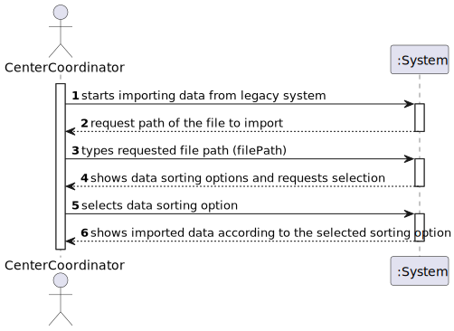
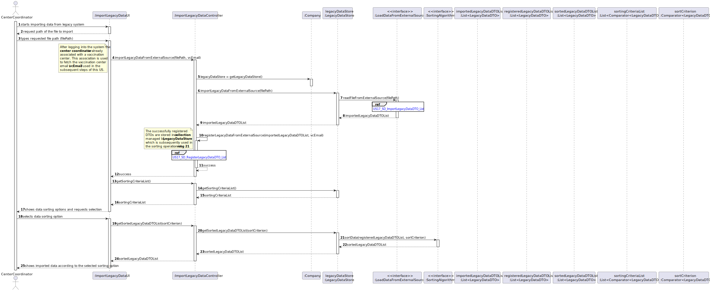
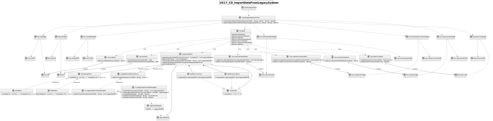

# US 17 - Import data from a legacy system that was used in the past

## 1. Requirements Engineering
### 1.1. User Story Description

As a center coordinator, I want to import data from a legacy system that was used in the past to manage centers.

### 1.2. Customer Specifications and Clarifications 

**From the Specifications Document:**

> The **Center Coordinator** wants to monitor the vaccination process, to see
statistics and charts, to evaluate the performance of the vaccination process, generate reports and
analyze data from other centers, **including data from legacy systems**."

**From the client specifications:**

> **Question**
> 
> - In the Sprint D requirements is stated that two sorting algorithms should be implemented and that the imported data should be sorted by arrival time or center leaving time. Should each algorithm be capable of both sortings or is one of the algorithms supposed to do one (e.g. arrival time) and the other the remaining sorting criteria (e.g. leaving time)?
>
> **Answer**
>
> - Each algorithm should be capable of doing both sortings. The application should be prepared to run both algorithms. The algorithm that will be used to sort data should be defined in a configuration file.

> **Question**
> 
> - It should be an option to choose to either sort by arrival time or by the center leaving time?
> 
> **Answer**
> 
> - The user can choose to sort by arrival time or by the center leaving time.

> **Question**
>
> - Validation for phoneNumber : should just verify if it has 9 digits? - Validation for CCCard: should just verify if it has 8 digits? - Validation for SNSUSER: should just verify if it has 9 digits also? For this validations it doens´t matter if it starts with 91,92, for example.
>    1- We just to be sure that the number of this itens has the right size?
>    2- Considering the Birthdate...Same Birthdate are not valid because is not a leap year, for example, 29/02/1957, 29/02/1961..... should we not do this validation and accept this invalid date? Because the user born in a day that doesn´t exist....
>
> **Answer**
>
> - 1- Yes, you are correct. The goal is only to validate the number of digits in attributes phoneNumber, CCCard and SNSUSER number .
> - 2- This is an error and I will update the file. The application must validate the dates. Thank you!

> **Question**
>
> - My question is now if only one or two SNS Users are not registered, should the whole legacy file be discarded?
>
> **Answer**
>
> - SNS users that are not registered should be loaded/registered. The other SNS users should not be registered again and should be ignored

> **Question**
>
> - Is there any correct format for the lot number? Should we simply assume that the lot number will always appear like this 21C16-05 ,like it's written in the file, and not validate it?
>
> **Answer**
>
> - The lot number has five alphanumeric characters an hyphen and two numerical characters (examples: 21C16-05 and A1C16-22 )

> **Question**
>
> - 1 - When sorting data by arrival time or central leaving time, should we sort from greater to smallest or from smallest to greater? 2 - Also, should we consider only time or date also? So, for example, if we sort from smaller to greater and consider a date also, 20/11/2020 11:00 would go before 20/12/2020 08:00. Without considering the date (only time) it would be 20/12/2020 08:00 before 20/11/2020 11:00.
>
> **Answer**
>
> - 1 - The user must be able to sort in ascending and descending order. 2. Date and time should be used to sort the data. Sort the data by date and then by time.

> **Question**
>
> - Should the configuration file be defined , manually, before strating the program? Or Should an administrator or another DGS entity be able to alter the file in a user interface?
>
> **Answer**
>
> - The configuration file should be edited manually.

### 1.3. Acceptance Criteria

- AC1: Implementation of two sorting algorithms to sort the imported data
- AC2: Analysis of the worst-case time complexity of implemented algorithm
- AC3: The coordinator must be able to choose a file to import

### 1.4. Found out Dependencies

This US depends on the design and correct functioning of [US1](../../SprintC/US/US01/US01_VaccinationSchedule.md), [US4](../../SprintC/US/US04/US04_RegisterSNSUserArrival.md) [US8](../US/US08/US08_RecordVaccineAdministration.md) and [US14](..\..\SprintC\US\US014\LoadCsvFile.md).

### 1.5 Input and Output Data

**Input Data**

* Typed data:
  
    * path of the file to import;

* Seleced data:

    * sorting criterion (arrival date or leaving date);

**Output Data**

* Imported data sorted by arrival/leaving time;

### 1.6. System Sequence Diagram (SSD)

### 1.7 Other Relevant Remarks

No other relevant remarks.

## 2. OO Analysis

### 2.1. Relevant Domain Model Excerpt 

## 3. Design - User Story Realization 

### 3.1. Rationale

**The rationale grounds on the SSD interactions and the identified input/output data.**

| Interaction ID                                                  | Question: Which class is responsible for... | Answer  | Justification (with patterns)  |
|:----------------------------------------------------------------|:--------------------- |:------------|:---------------------------- |
| Step 1: starts importing data from legacy system                | ... interacting with the actor?  | ImportLegacyDataUI   | **Pure Fabrication**: there is no reason to assign this responsibility to any existing class in the Domain Model. |
| Step 2: requests the file path                                  | ... asking for the user input? (path of the file to import)       | ImporLegacyDataUI  | **Pure Fabrication** |
| Step 3: types the file path                                     | ... handling user input and coordinating the subsequent steps?      | ImportLegacyDataController  | **Controller**: coordinates the interaction between the UI layer and the domain layer. |
|                                                                 | ... importing data from an external source?       |  LoadDataFromExternalSource  | **Protected variations**: point of variation stabilized through the use of an interface for reading data from external sources (files, external modules, etc). |
|                                                                 | ... reading the data from the csv file and returning the expected system data? | CsvFileReaderLegacyDataAdapter CsvFileReaderLegacyDataAdaptee | **Adapter**: allows the use of external modules/APIs by converting the request according to our system into requests used by the external module, in this case the class for reading the csv file. |
|                                                                 | ... encapsulating the legacy data read from the csv file for transferring to the domain layer? | LegacyDataDTO | **DTO**: external information is encapsulated and transferred to the domain for further processing. | 
|                                                                 | ... coordinating the registering process the imported data into the system? | ImportLegacyDataController | **Controller**: delegates and asks the objects of the domain to execute the actions required. | 
|                                                                 | ... checking if the SnsUser exists in the system? | SnsUserStore | **IE**: has the collection of all SnsUser instances. | 
|                                                                 | ... verify if a vaccination schedule already exists? | VaccinationScheduleStore | **IE**: has the collection of all SnsUser instances. | 
|                                                                 | ... creating and saving a new vaccination schedule object? | VaccinationScheduleStore | **Creator and IE**: rule 1 and 2 (aggregates instances of the required class and records all instances of that class). IE pattern when saving the object since this class is responsible for recording all VaccinationSchedule objects. | 
|                                                                 | ... instantiating and saving a new SnsUser arrival object? | SnsUserArrivalStore | **Creator and IE**: rule 1 and 2. | 
|                                                                 | ... creating and saving a new instance of VaccineAdministration class? | VaccineAdministrationStore | **Creator and IE**: rule 1 and 2. | 
|                                                                 | ... store the LegacyDataDTO objects successfully registered in the system? | LegacyDataStore | **IE**: records successfully registered LegacyDataDTO objects. | 
|                                                                 | ... providing the criteria classes for sorting the registered data? | LegacyDataStore | **HC+LC/IE**: class responsible for managing the registered LegacyDataDTO collection and therefore should provide the necessary funcionality to manage the collection. | 
| Step 4: shows data sorting options and requests selection       | ... showing the sorting criteria options to the user? | ImportLegacyDataUI | **IE**: Responsible for interacting with the user. |
| Step 5: selects data sorting option                             | ... handling user input and requesting the sorted imported data? | ImportLegacyDataController | **Controller** |
|                                                                 | ... providing the sorted list? | LegacyDataStore | **IE**: records all successfully registered LegacyDataDTO objects.|
|                                                                 | ... sorting the collection? | SortingAlgorithm | **Polymorphism**: interface for handling alternative sorting algorithms based on the config file input.|
| Step 6: shows imported data according to the selected sorting option | ... sorting the collection? | ImportLegacyDataUI | **IE**: Responsible for interacting with the user. |

### Systematization ##

According to the taken rationale, the conceptual classes promoted to software classes are: 
* VaccineAdministration
* ExternalModule (LoadDataFromExternalSource)

Other software classes identified: 
 * ImporLegacyDataUI (Pure fabrication)
 * ImportLegacyDataController (Pure fabrication)
 * LegacyDataStore (HC+LC/IE)
 * SortingAlgorithm (Polymorphism)
 * CsvFileReaderAdapter/CsvFileReaderAdaptee (Adapter)
 
## 3.2. Sequence Diagram (SD)

## 3.3. Class Diagram (CD)

# 4. Tests 
n/a

# 5. Construction (Implementation)
n/a

# 6. Integration and Demo 

n/a
# 7. Observations

n/a

